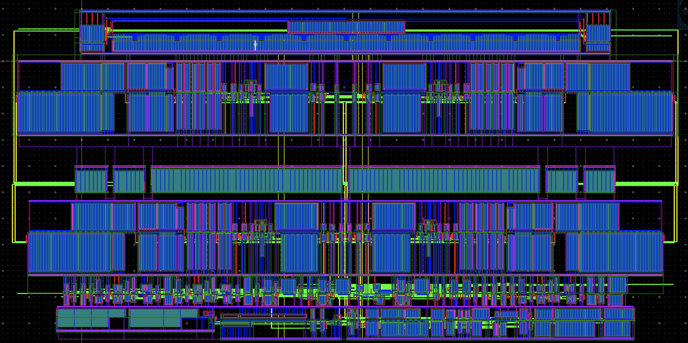
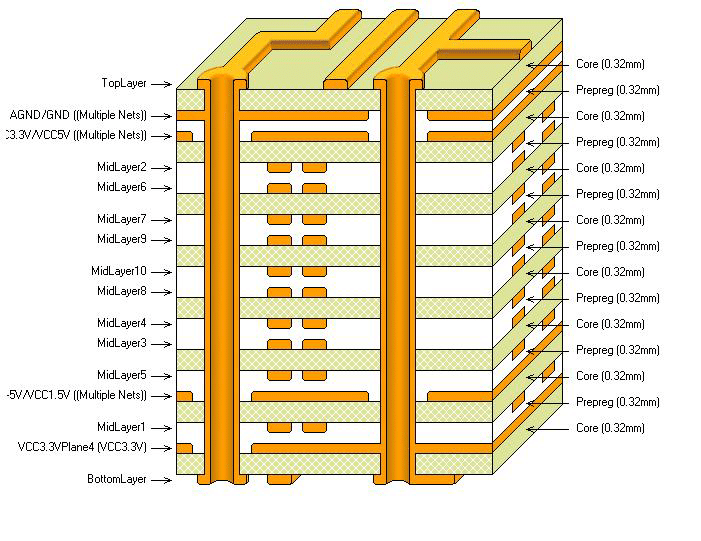
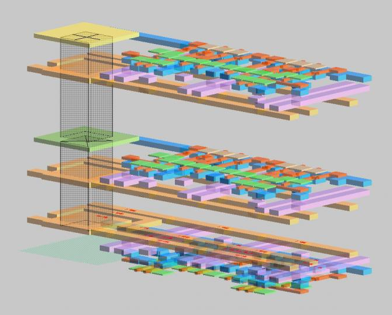
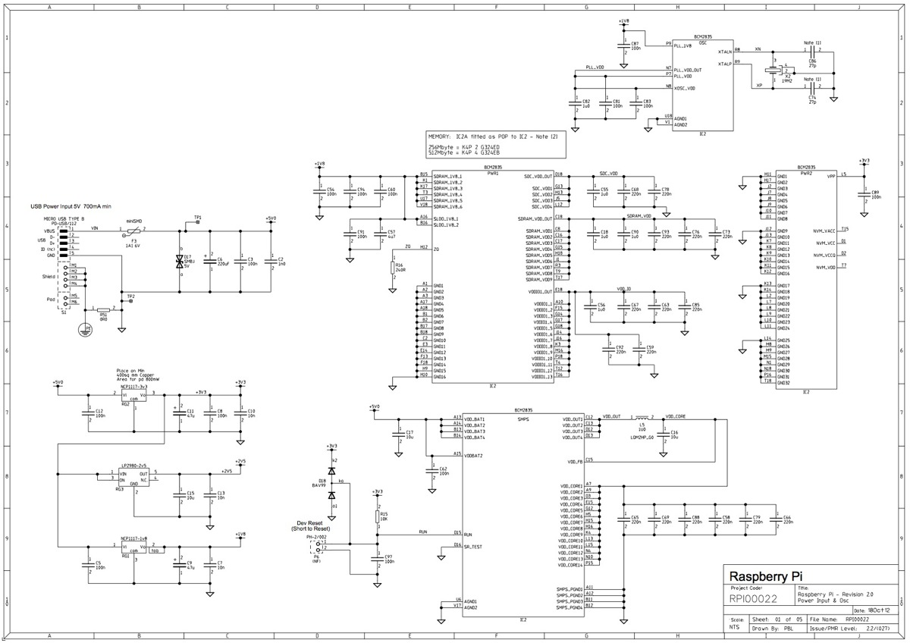

# The Languages of Hardware

Here's a thought experiment: close your eyes and picture the office of a thriving software company.  Say, Facebook or Google.  What does it look like?  You probably imagine a group of young people strewn about a bright, open office plan.  Everyone has between one and ten large-screen monitors.  And on those monitors, the one quantity you can be *sure* you'll see: code. 


Now let's repeat this experiment, but replace the software group with a similarly successful team *designing a chip*.  (Maybe it's the same chip that "team A's" code will run on.)  What does this look like?  

Many of us likely have a far less vivid idea.  Is it the Intel clean-room?  A high-tech manufacturing line?  Are there robots?  Maybe this looks more like a science lab, full of equipment taking measurements and readings of, well, something. 

In reality, these activities don't look terribly different.  As we'll learn, for the past several decades the majority of your electronics have been designed in code.  Hardware has its own favorite (and least favorite) languages, and their accompanying programming paradigms.  The process by which this code represents, and ultimately generates, a piece of hardware is the central topic of *HW Makes SW*.  Our first stop will be the most widely-used languages and models. 


## Hardware Description Paradigms 

Hardware programming, or hardware *description*, has a common set of popular paradigms.  We can look at them by analogy to a software build pipeline.  *Instructions* form a sort of bedrock complexity layer for programs.  Their definition forms the core of the software-hardware execution interface.  No matter how high-faluting of modern code we can write, we know the computer ultimately works on a series of instructions.  Something along the way, often a compiler, interpreter, or a combination thereof, must translate down to instructions the target hardware can understand.  Along the way, these bits of code often traverse through a few layers:

- High-Level Language
- C (ish) Level
- Assembly 
- Machine Code

The languages of hardware build down an analogous track, which we will examine bottom-up, starting with the lowest layer. 


### Machine Code: The Geometric Model

The most literal, and lowest-level, model of a piece of hardware boils down to a physical blueprint.  While arbitrary-shape mechanical structures generally require a 3-D representation, silicon chips and circuit boards are arranged in layered pseudo-2D structures, amenable to a description known as a *layout*.  A layout-based description is essentially comprised of a set of two-dimensional polygons, each tagged with a *layer* indicating their location in the third dimension.  




The set of available layers is often referred to as the *stack* of the underlying fabrication technology.  For chips, different layers are highly heterogeneous: some indicate areas of ion-diffusions, while others represent pieces of metal.  PCB stacks are closer to homogeneous; each layer generally represents metal interconnect.  



Three-dimensional views comprising both the stack and the layout are possible, and can help illustrate the physical 3D reality.  Notably, these 3D views are excessively uncommon in the hardware design process.  Layout views near universally fulfill this role. 




Layout is rarely referred to as a *language*.  But it's important to note this is the bedrock layer at which hardware is described, and the only layer from which it can be directly fabricated.  (Much as its native instructions are the only layer which your computer can execute!)  In a future article we will explore the programming models of layout, both automated and manual. 


### Assembly Code: The Structural Model

Circuits are often described without reference to their physical content, using *structural* models comprised of a set of (slightly) abstract *instances* and *connections* there-between.  A common example is a transistor-level description.  Transistors are often described as the irreducible quantities of silicon design; in fact they are comprised of the very same geometric layers pictured above (representing metals, silicon dioxide, ions, and the like).  

While structural models can contain transistors, their hierarchical power comes from abstracting away other *modules* of hardware description.  The *module* concept is one of the most central and popular abstractions in hardware.  The external interface to a module is embodied by its *ports*, indicating which of its signals it intends to connect outwardly.  Connections between these module-instances are commonly described via a set of signals and ports.  

The representation of these structural descriptions varies widely, particularly between digital and analog flavors of hardware design.  Typical digital design, including that which generated the processor you're running now, use *hardware description languages*.  Verilog is overwhelmingly the most widely-used such language, and VHDL is a relatively distant second.  Both are derived from C, and aesthetically lie somewhere between C and C++.  Instances, ports, and signals look particularly similar to data members of C++ classes. 

```verilog
module MyModule(clk, reset); 
    input clk, reset, 
    wire inp, out;     
    SubModule sub1(clock, reset, inp, out);
    SubModule sub2(clock, reset, out, inp);
    // ... Lots more content! ... 
endmodule
```

Analog and PCB-level electronics, in contrast, overwhelmingly favor a graphical *schematic* form of structural description.  In a schematic, each instance is represented by a graphical object, often visually conveying its function.  Signals and connections are represented by connected sets of lines. 




Why such a stark divide?  There's no fundamentally good reason.  It's more historical, cultural, and a self-reinforcing combination of the two.  Advocates of the graphical form find it a more intuitive visual representation of how signals (typically voltages and currents) move through the design.  These graphical descriptions tend to be self-limiting to relatively small designs, not the multi-billion transistors common on modern SoCs.  The code-based approaches, in contrast, benefit from the simplicity and portability of text, and the litany of code-based tools built for software, such as modern revision control.  In a future article we'll take a closer look at why digital won (and analog lost) the war to be the primary paradigm of electronics. 


### The C(ish) Level: Behavioral Models

Verilog and VHDL, the two primary digital hardware-description languages, largely have roots in C.  Their C-programming heritage is not born from their ability to represent circuits structurally, but to add *procedural* constructs, analogous to the methods of a C++ class.  These *procedural blocks* run line-by-line from beginning to end, much more like the functions of software languages.  The `Sequential` module below introduces the procedural block. 

```verilog
module SequentialModule();
	reg a, b, f, g;     // Signal declarations
	initial begin       // First procedural block!  
		#10  a = 0;
		#11  a = 1;
		#12  a = 0;
		#13  a = 1;
	end

	always @(a or b) begin 
		if (b == 1) begin 
			f = a;
			if (g == 1) g = ~a;
			else g = ~b;
		end 
		else begin
			f = b;
			if (g == 1) g = a & b;
			else g = a | b;
		end
	end
endmodule
```

Note these procedural blocks are anonymous; `initial` and `always` are not their names, but keywords indicating when they should run.  (More on this to come.)  While Verilog methods can be labeled, the majority are anonymous, like the `initial` block of the `sequential` module.  Typical C-level programming constructs, such as `if`/`else` branching, loops, case-statements, and a limited set of data structures are supported in these procedural "functions". 

This likely brings a question to mind: *when do these functions run*?  First it's important to note, Verilog code is generally not executable on its own.  A few common run-times execute it in different modes.  The first (and foremost) run-time we'll examine is *event-driven simulation*.  In such simulations, most procedural blocks are not explicitly called.  They are instead *triggered* by events occurring elsewhere in the simulated hardware.  The languages include keywords for common trigger-events such as: 

- Beginning of simulation (`initial`)
- On change of a particular signal (`always`)
- On changes of rising/ falling edge polarity (`posedge`, `negedge`)

And several more.  This discrete-event representation is sufficiently general to capture nearly all practical digital chip design.  GitHub holds a few such examples, such as the [PicoRV32](https://github.com/cliffordwolf/picorv32) RISC-V CPU, and Western Digital's [Swerve](https://github.com/westerndigitalcorporation/swerv_eh1) CPU cores. 

```verilog
module RISCVCPU (clock);        // A RISC-V module excerpt 
	parameter LD = 7'b000_0011, 	// Instruction opcodes
		SD = 7'b010_0011, 
		BEQ = 7'b110_0011, 
		NOP = 32'h0000_0013, 
		ALUop = 7'b001_0011; 
	input clock;
	reg [63:0] PC; 
	// ... 

	integer i; 
	initial begin
		for (i=0; i<=31; i=i+1) Regs[i] = i;
	end

	always @(posedge clock) begin
		// Fetch & increment PC
		IFIDIR <= IMemory[PC >> 2];
		PC <= PC + 4;
		IDEXA <= Regs[IFIDrs1]; 
		IDEXB <= Regs[IFIDrs2]; 
		// ...
	end
	// ...
endmodule
```


A typical HDL simulator runs an event-loop, processing these events in order, and adding new ones as procedural blocks, logical and arithmetic operations, and signal assignments generate them.   In a future article we will explore the mechanics of these event-based simulation runtimes. 

A second critical run-time for the C-like HDLs is *logic synthesis*.  This is effectively the compiler for digital chip design.  A typical synthesis program takes two primary inputs: the HDL source code, and *library* information on the available logic gates in the target technology.  This second runtime introduces a fairly significant difference between HDLs and their software brethren: many HDL programs which *can be run*, *can't be compiled*.  HDLs include the notion of a *synthesizable subset* of constructs, which can be converted into gate-level netlists.  Most event-driven procedural blocks, such as that of `RISCVCPU` above, can generally be synthesized.  Other test-focused constructs such as `initial` are limited to simulation.  In future posts we'll explore the verification-focused features of SystemVerilog, which include a far richer programmer's feature-set, at the expense of not being able to synthesize hardware. 


### High-Level Hardware Languages

Above this C(ish) level, hardware languages diverge (even further) by domain.  *High level models* mean very different things to different engineers.  Large systems-on-chip benefit from transaction-level models, often composed in [SystemC](https://en.wikipedia.org/wiki/SystemC).  Special-purpose circuits are often designed in similarly special-purpose analytical models, often designed in conventional programming languages, or graphical tools such as Simulink. 

*High-level synthesis* refers to a category of tools which generate hardware descriptions from algorithmic descriptions of what the hardware should do, leaving out many of the hardware-description details such as modules, ports, and signals.  often written in C++ and similar languages.  These tools attempt to abstract away many of the details of the *hardware* (clocks, resets, and the like), without materially expanding the programming-language feature set.  (Typical programs would be a restricted subset of C or C++.)


### The Future

The primary trend in new HDLs, particularly those from academia, is to instead create a *hardware description library*, embedded inside an existing high-level programming language.  [Chisel](https://chisel.eecs.berkeley.edu/), written in Scala and designed tightly in conjunction with [RISC-V](https://riscv.org/), is probably the most prominent example.  Engineers at [Google](https://www.youtube.com/watch?v=x85342Cny8c&) and other large companies have detailed their experience using this relatively new tool-chain.  Notably, Chisel and comparable libraries do not attempt high-level synthesis; they instead primarily focus on the structural model, and embed its construction in the productivity-focused features of its high-level programming language.  

The picture we've laid out here came together over a *long* time.  Software engineering moves a mile a minute; seemingly every week a new tool, framework, or language has risen to popularity, and another has fallen in its place.  Verilog, in contrast, was introduced in 1984, and remains industry-standard today.  Hardware folks move cautiously.  

But there is reason to believe this space is ripe for change.  The next generation of hardware - both the companies and the engineers - will come from the software space, with very different attitudes about moving quickly, adopting new productivity technologies, and sharing them. 

