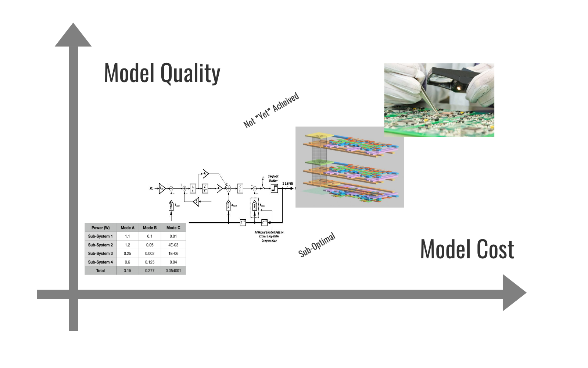

## Models All The Way Down

In the first chapters of *Software Makes Hardware*, we introduced the basics of how electronics and silicon are generated (in code), and the primary languages used to design them.  

One term we used regularly - with no introduction whatsoever - is *model*.  This is a common term for hardware, which tends to mean very different things to different audiences.  Here this term will be used in an atypical, and hopefully more valuable sense.  (The authors of [*How to Read a Book*](https://en.wikipedia.org/wiki/How_to_Read_a_Book) would call this one of our *key terms*.) 

Here, a *model* is a representation of a future piece of hardware.  

*Any* representation.  Models can be physical or virtual, simple or elaborate.  They can attempt to comprehensively capture all of the traits of a system, or focus on a specific few.  Spreadsheets, schematics, Verilog, dedicated modeling programs, and elaborate prototypes all meet these *model* criteria.

This may be striking as an unusually broad definition.  We'll introduce a model cost-quality plane which will convey a central point: all of these are flavors of the same thing at heart.  And thinking of them as such can provide a deeper understanding of what each is supposed to do. 

Slightly more accurately, models tend to represent future *pieces* (plural) of hardware.  It helps to recognize the goal of creating hardware en masse: the goal is not creating a single chip, board, system, or device, but many - perhaps even millions or billions.  And most crucially, all of these instances are at least subtly different.  Physically-built things vary, at least a little.  Environmental conditions vary.  Perhaps more impactfully, their use cases and contexts change.  This is most important for the most general-purpose pieces of hardware.  For engineers at Apple, for example, the challenge is not designing an iPhone, but millions of phones in millions of pockets worldwide.  

The conclusions here tend to work best for the most repeated hardware, i.e. that which will be replicated the most times, in the most varied contexts.  Nonetheless many of these conclusions also apply to the highest complexity hardware, regardless of its quantity.  The most extreme examples are projects that with quantities of exactly one, often including their uniqueness with a *the* in their name: *The* International Space Station, *The* Bay Bridge.

### Design and Analysis Models 

While our definition will seem overly broad to many hardware practitioners, there are other common uses of the term *model* which we will not mean here.  

The models deployed in electronics-design make predictions about the things *being designed*.  The modeler then has some level of autonomy as to whether his model, and the predictions it makes, are suitable to go forth towards his design goal.  We could refer to this category as *design modeling*, where the goal is making predictions about a future system to be created, and then editing either that system or its model until reaching desirable results.  

The sense of *model* which we do not mean here, is what we'll call *analysis modeling*.  Examples include weather predictions, stock market forecasting, and FiveThirtyEight's polling-based election predictions.  These share their predictive quality with models of electronics, but differ in that the modelers are not trying to *create* the effects being predicted.  The weatherman does a great deal of analysis, and provides a valuable service, but ultimately has no control over which weather to deploy.  

With this caveat, we'll use the term *model* to more specifically mean *design-model* from here on. 

### [All Models Are Wrong](https://en.wikipedia.org/wiki/All_models_are_wrong)

```
All models are wrong. 
But some are useful. 

- Generally attributed to statistician George Box
```

This can sound pessimistic.  But it captures a crucial reality of what we'll call *the modeling problem*: no model can capture every facet of reality.  The universe is just too complicated to capture all of the physical, mechanical, thermal, and human factors which can interact with a piece of hardware and software - or any real-world system, for that matter.  

Models are then necessarily limited, both in scope and in depth.  Generally, the more factors a model can incorporate, the more costly it will be to produce and to use.  We can say that its predictions come at higher cost.  We can then imagine all sorts of models on an x-y plane comparing their *cost* versus their *quality*:



Here we mean both *cost* and *quality* in very general senses.  *Quality* refers both to scope, i.e. the breadth of effects which a model can incorporate, and depth, i.e. the specificity and granularity of its predictions.  By *cost* we also mean something more general than dollars; this includes time - both in crafting and execution, expertise, availability of experts. 

The model-plane has three regions:

* Its bottom-right is the *sub-optimal* region.  Models in this region *exist*, i.e. they can be created, but provide predictions *worse* than those on the frontier.  Most - in fact nearly all - models will fall in this region.
* The top-left is an *unachieved* region. In this space, no models lie.  The best models yet created provide less quality at a given cost, or cost more at a given quality.  Note that while some of the top-left space may be *unachievable*, ever (perfect predictions at zero cost certainly included), much of it is likely better described as *not achieved - yet*.  Other than perfection, there are few fundamental limits on our ability to improve either the quality or cost of model-predictions, given enough energy, time, and incentive to do so. 
* Dividing the two spaces is the *modeling frontier*.  The frontier forms a pareto-front, above which no model's combination of cost and quality has climbed.  In some sense the true quality (or perhaps, efficiency) of a model is its distance from this front.  It is possible to create models at any point below this line; these points are all just *worse* than the ones which lie on it.  Improvements in modeling, whether through new technology, new insight, or additional attention, push this front upward.

Note that although the frontier is drawn as roughly linear, this is no prediction about its shape.  It may be linear or exponential, or have large discontinuities.  Different curves may - and likely will - emerge with respect to different phenomena, and for different systems.  The specific shape of the frontier is not the point - only the idea that it exists, and sets a ceiling on how much predicted value can be gained at a given cost. 

The real value of the cost-quality plane is that it highlights the shared, underlying goal of each point on its spectrum: making predictions about how future systems will behave.  Spreadsheets, simulations, IC layouts, 3D CAD, and FPGA emulation may lie at very different points on this plane.  *But they all lie on the same plane.*   And vitally, the only basis for choosing which models to build is *economic*.  A model is worth making in exactly one case: when the predictions it provides are worth more than the cost of its creation.  


### Failure of the Most Elaborate Models: Or, Antennagate

A famous case from recent Apple history, where I worked from 2009-19, serves an example of where even the most elaborate model can break down.  (Note none of Apple's famous secrets are disbursed here; all of this information is publicly available.)  

A prototype iPhone is among the most complex, highest-cost items we would place on our model plane.  Its creation requires the coordination of thousands of highly skilled people, designing software, electronics, enclosures, antennas, chips, and the like.  While building a single prototype may not require advanced high-volume manufacturing techniques, rarely will one be created which does not follow an eventually mass-production plan for construction.  In other words, many of the costs of crafting hundreds of millions of instances must be borne to make the first. 

Yet the prototype, as all models, is wrong.  It may differ in only immaterial - if any - respect from the hardware and software to be mass-produced.  Yet a batch of ten or one hundred is necessarily far different from batches of millions.  For one, the variation among these devices cannot truly be captured at scale, until scale truly exists.  But more commonly, differences in their use case differ far more. 

Case in point: the iPhone 4.  Apple released its fourth-generation phone in 2010.  Its introduction of high-resolution display and camera ushered in the smartphone industry’s arms races of the next decade.  A first-of-its-kind external antenna design, merging the functions of enclosure and wireless transmission, enabled a step change in its dimensions and design.  (In my tenure, this was our most exciting product launch.  Bill Gates is often mocked for saying the Windows 95 launch was the peak of his tenure with Microsoft.  I see no shame in any such statement; I look back at the iPhone 4 launch the same way.) 

For months before launch, engineers and other staff used prototypes as their personal phones, in as close to real-life context as they could create.  They took them home.  They took them to the gym.  They took them to their kid's schools, on international flights, and into Redwood City bars.  And all reported   generally positive results.  

Yet shortly after its launch, iPhone users revolted at the external antenna's tendency to lose reception when held in several common orientations.  After initial push-back, including infamously retorting that “[you’re holding it wrong](https://www.engadget.com/2010/06/24/apple-responds-over-iphone-4-reception-issues-youre-holding-th/?guccounter=1&guce_referrer=aHR0cHM6Ly93d3cuZ29vZ2xlLmNvbS8&guce_referrer_sig=AQAAACXMitgfOhoFyYNEImvNetUvYFVXtDpoRofdw5-Un48m7GnkCOimOxGQz1OloabJMFQ4Nw7T-RoUybKeLGY-ID1rfuHLp8bYHPMc4zrjLqkvP53E5jhl1xA1mexUFOVjQfeE7n4l_8ppJU7N_nKw_LfooCY6sUBakxGS_juRJEnA)”, Apple acquiesced to angry users, and offered a each a protective (and hand-insulating) case, free of charge. 

What generated such a wide gap between the staff and user response?  Several factors likely contributed.  One certainly did: the use of plastic "stealth cases" designed to disguise the prototype iPhone 4 as a prior-generation iPhone 3GS.  In order to keep the updated design secret (an effort which [failed in other ways](https://gizmodo.com/this-is-apples-next-iphone-5520164)), prototypes were used solely in plastic cases.  And those cases did just enough to insulate the exposed antenna from users' hands, and avoid any perceptible changes in reception. 

### If the Most Elaborate Model Can Fail, Why Make a Simpler One? 

The iPhone 4 story is not meant to cast dispersion on the act of prototype-making, or on anyone involved.  The point is simply that even the most elaborate models can fail.  One may then ask, if spending thousands of man-years and millions of dollars cannot capture all the relevant reality, what hope have relatively simple models, such as spreadsheets, schematics, or simulations? 

The answer is embedded in that question: these more limited models *don't* cost nearly as much as their more elaborate counterparts.  They sit far to the left on the model-plane, offering far less comprehensive predictions, in exchange for a far lower cost.  The selection of which of these more limited models to build and use, and the details of which effects they include, is the core of the aforementioned *modeling problem*.  This is a problem with no general answer, and likely no ideal answer even to any specific case.  At best we can make directional and qualitative advice about how to tackle it. 

The iPhone prototypes hold a valuable insight into the modeling problem.  The goal is not comprehensiveness: capturing *every* effect is futile.  The goal is identifying which effects will matter to the success of the eventual system, and capturing them efficiently.  


### Physical and Virtual Models

Different areas of engineering take very different approaches to making models.  In other words, they choose different points on the model-plane.  We'll differentiate between two types of models which have a fairly stark difference in cost of creation.  *Physical models* are exactly that: physical objects which represent some facet of the future hardware.  These may be fully realized prototypes, or may capture only a subset of the physical reality, such as antenna-only or enclosure-only hardware with dummy electronics.  *Virtual models*, in contrast, have no physical component.  They exist purely as pieces of software.  This includes representations commonly used in a build-flow, such as HDL code, gate-level netlists, and layouts, as well as off-build models attempting to create more streamlined or efficient representations - MATLAB/ Simulink for example.

Generally if they are economically viable, there are good reasons to prefer physical models over virtual ones.  Physical models generally capture at least *some* aspect of the underlying reality not foreseen by the software modeler. 

Chip guys - especially the analog ones - are extremely haughty about the importance of their software simulations.  This crowd not only could not fathom building a physical prototype without them, most would regard doing so as a primitive act of non-engineering.  Most are dumbfounded to learn that their system-electronics brethren down the hallway do this all the time.  (And they'll be doubly horrified later in this article, when they learn the atrocities of their colleagues in the mechanical engineering department.)  

No matter how insufferable, their haughtiness is backed by a real economic reality: building chips - actually fabricating physical ones - is really expensive, and really time-consuming.  In the state of the art nanometer-scale technologies used for chips like a mobile SoC, upfront fabrication costs can be in the millions.  Worse yet, fabrication of the first devices generally takes several months.  When describing this for friends in software, I often have them imagine how they'd design if every "build and run" button cost $10 million, and they didn't find out the result for 90 days.  

System-electronics - circuit boards and combinations thereof - can be prototyped far more effectively.  Even relatively complex circuit boards can be fabricated in a few days.  Most components (excepting that custom-designed silicon!) can be purchased off the shelf, and assembled by standard, widely available, automatic equipment.  Custom mechanical components such as enclosures can generally be prototyped even more effectively, through quick-turn molding, machining, or more recently, 3D-printing.  It's perfectly common for even the most massively-produced such parts to skip software simulation altogether, and solely rely on prototypes to verify their vital characteristics.  If there are engineering debates between which of several paths may prove best, build them all and see!  Running such items through their full battery of quality checks (say, having an intern from MIT drop them on the floor 500 times overnight) is often less costly than designing a piece of software to predict which will win.  (These are the atrocities which will convince our chip-friends that mechanical engineering is not only sub-engineering, it's sub-human.) 

This level of flexibility of course pales in comparison to the most flexible product yet conceived: software delivered over the internet.  Facebook, for example, reports that at any given time somewhere between 1000 and 5000 different versions of their site are running, being delivered to fractions of their billions of users worldwide.  Each can be tracked for vital metrics, both in performance and in business viability, and the winners can be incorporated into the main-line, primary version.  These thousands of variants are models in a sense, and only differ from the target product through the sub-sampling of users. 

No physical product can hope to match this degree of agility.  Pieces of hardware with months-long assembly times appear to have even less hope.  But the means by which hardware products can approximate this level of flexibility will be a central theme of *Software Makes Hardware*.  
