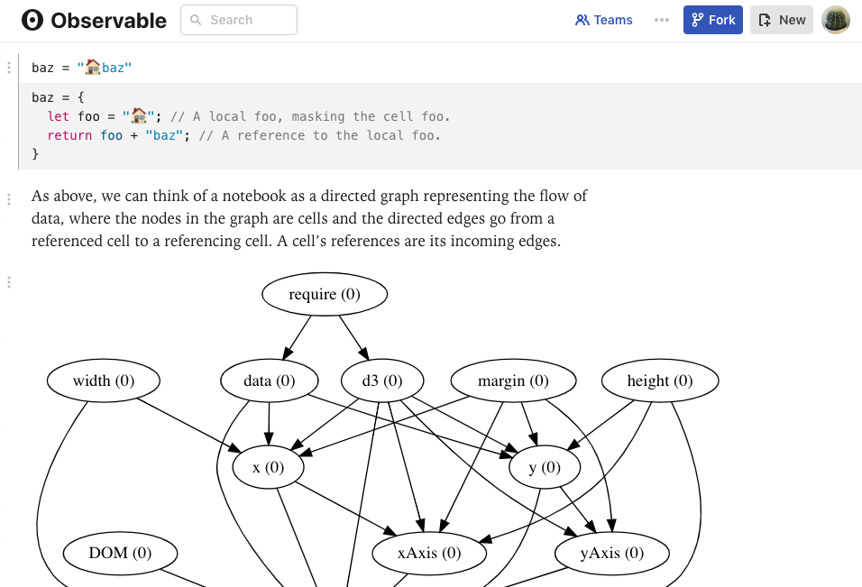

# Reactive & Event-Driven Hardware

In [past *Software Makes Hardware* chapters]() we introduced a hardware abstraction ladder, including physical, structural, and behavioral layers.  Here we'll dig into a few patterns common at the *behavioral level*. 

These ideas will look strangely familiar to anyone working on the modern web.  As software has become more asynchronous, it has embraced some of the same ideas designed into hardware languages.  Prominent examples include the *reactive* and *event-driven* patterns.  

The chip industry's two most popular hardware description languages (HDLs), Verilog and VHDL, were both created in the mid 1980s.  Their behavioral-description facilities are heavily based on these two patterns, which map directly onto popular hardware-design styles. 

## Reactive Pattern

In [reactive programming](https://en.wikipedia.org/wiki/Reactive_programming), a piece of software describes static relationships between input and output quantities, which continue to hold even when the input quantities change. 

The reactive style is quick to illustrate through a comparison with the more common *imperative* style.  In either, we can imagine setting three variables as such:

```
a = 1
b = 2
c = a + b 

c
```
```
3
```

Imperative and reactive styles differ when the values of `a` or `b` are  changed - *after* the assignment to `c`.  In the typical imperative pardigm, the value of c is unchanged: 

```
a = 11

c
```
```
3
```

The assignment statement `c = a + b` refers to the *values* of a and b, *now* -- at the time of the assignment. 

In the reactive pattern, assignment means something different -- essentially that `c` should equal the total of `a` and `b`, *forever*.

```
a = 1
b = 2
c = a + b 

c
```
```
3
```
```
a = 11
b = 22

c
```
```
33
```

This is a fairly different idea of what assignment means.  Updating the value of c happens in the background, whenever its input arguments change. 

Popular implementations of reactive programming patterns include the [Observable Notebook](https://observablehq.com/@observablehq/how-observable-runs), and everyone’s least favorite, Excel spreadsheet formulas.  Data is free to change well after formulas are entered; in fact this is generally the point.



In procedural programming languages, supporting the reactive style requires something like a dependency graph between variables, and a set of update methods called when an input variable changes value.  

### Reactive Hardware 

The reactive pattern maps so cleanly into hardware, it was built directly into most popular HDLs.  Verilog uses an `assign` keyword to make reactive, or in its lingo, *continuous assignments*. 

```verilog
module combinational (  
  input a, b, c, d, output  o);
 
  assign o = ~((a & b) | c ^ d);
endmodule
```

These reactive assignments map directly to combinational logic, that is, logic in which the outputs are functions solely of the current state of the inputs.  For the verilog example above, we can imagine a synthesis program mapping to a logic circuit like so:


The HDL code is a platform-independent (process independent) description of this set of logic, which can be compiled to near arbitrary fabrication technology. 

The reactive pattern is fairly low-level behavioral description.  It captures the combinational relationships between hardware signals.  It has no means of incorporating the state, or history, of the system.

## Event-Driven Pattern

The *event-driven* paradigm can colloquially be described as something like:

* Stuff happens
* Code runs in response 

Where the "stuff" happening can be described as a series of *events*, and the code running in response is typically a set of callback functions.  In a web environment, typical events would include user interactions (clicks, keystrokes), timers, or the completion of slow asynchronous operations, such as file I/O or networking.  

In hardware description, events typically come in the form of changes elsewhere in the system.  HDLs include built-in syntax for capturing the sensitivity of a method -- or in HDL lingo, a *procedural block* -- to changes in signal values.  

The event-driven pattern is commonly used to describe *sequential logic*, in which the outputs of a hardware module are functions of both the current inputs, and the module's current state.  Most digital hardware is *synchronous*, in that its operations are triggered by edges of a widely distributed timing signal, commonly called the *clock*.  A common combination of the sequential and synchronous styles is the *finite state machine* (FSM).  

```verilog
module fsm ( /* ... */ ) 
  always @ (posedge clock or negedge reset)
    next_state = state;
    out = 0;
    case (state)
      A : 
        if (in) next_state = C;
        else next_state = B;
      B : 
        if (in) begin
          out = 1;
          next_state = C;
        end
      C : 
        if (~in) begin
          out = 1;
          next_state = B;
        end
      default : begin
          out = 1’bX;
          next_state = 3’bX;
        end
    endcase
  end
endmodule
```

These procedural methods are generally called by an *event loop*, analogous to that at the heart of an async runtime such as NodeJS or Python's `asyncio`. 

## That Reminds Me: When Does Any of This Code *Run*? 

By now you may be wondering, when does this code run?  

Unlike typical software, behavioral HDL code operates in (at least) two essential runtimes: 

* *Logic Synthesis* is the compilation of behavioral HDL code into lower level representation, usually logic gates.  
    * Think of this as the compiler.  Although note the language output from this compiler is often the same as its input, i.e. Verilog.  The output just uses the lower-level constructs and avoids the higher-level ones. 
* *Simulation* is the runtime which predicts the hardwares behavior.  
    * Most of the behavioral constructs discussed here -- reactive updates, sensitivities, event loops, and the like -- apply to this simulation runtime.  

Perhaps even less intuitively, not all HDL programs which can *run* also *compile*.  This is the opposite of compiled software languages, for which compilation is the only direct runtime for language-native code; execution then operates on the compiler output, whether machine-code or another layer of platform-independent byte-code.  

In contrast it’s perfectly common for hardware descriptions to execute as desired in simulation, but fail to compile to gates.  This just reflects the fact that the set of valid HDL is larger than the set realizable in gates.  HDL methods can print to the console, save to files, call external C code, and generally do a whole host of things that have no gate-level representation.  

HDLs commonly refer to this idea as having a *synthesizable language subset*.  Even for hardware modules inside the synthesizable subset, behavioral simulation proves a necessary performance optimization.  It’s *possible* to always synthesize and simulate gate-level circuits, but incredibly costly.  Synthesis runtimes tend to be an order of magnitude longer than simulation runtimes, and gate-level simulations further add to this total.  And in raw time, these are not trivial changes: synthesis and simulation times on the order of hours (or even days) are common.  

Many situations regard the event-driven behavioral descriptions similarly to how this view sees gates: too much detail, too slow, for no relevant increase in insight.  This is an example of how hardware building is model making; these models fails the criteria described in [*Models All The Way Down*](). 

## High-Level Hardware Description 

Nearly every complex piece of digital hardware you use was written in either Verilog or VHDL.  This includes essentially every chip required for your reading this article -- your computer (or smartphone) CPU, the network interface transmitting and receiving this document, and the GPU rendering it on your screen.  These languages were both born in the mid 1980s, and resemble a C++-ish level of abstraction and productivity.  In the decades since, no consensus has emerged in the hardware community on how to raise the level of designer productivity to mirror that of modern, programmer-centric software languages.  

The initial, and perhaps still most prevalent, efforts use a set of scripting languages (Perl, Bash, or TCL) to generate Verilog or VHDL.  

*High-Level Synthesis* refers to a set of tools and techniques which attempt to describe hardware *functionality* in a relatively low-level software language such as C++, removing all of the hardware abstractions such as modules, ports, signals, and wires.  HLS dramatically elevates the described level of hardware abstraction - effectively removing it altogether -- without materially changing the *description language* abstraction level. 

A newer and contrasting approach, primarily borne from academia, uses modern hardware-description *libraries* built atop existing programming languages.  These libraries near universally eschew HLS, and in many cases drop the event-driven behavioral paradigm.  Modern HDLs instead focus on using the high-productivity programming language facilities to manipulate a structural hardware description, perhaps incorporating the reactive, continuous assignments at the bottom of the behavioral hardware modeling spectrum. 

To date the most accomplished modern HDL is [Chisel](https://chisel.eecs.berkeley.edu/), developed at UC Berkeley.  Chisel is embedded in Scala, and uses a combination of object-oriented and functional programming to craft structural-level hardware. 

```scala
import chisel3._

class GCD extends Module {
  val io = IO(new Bundle {
    val a  = Input(UInt(32.W))
    val b  = Input(UInt(32.W))
    val e  = Input(Bool())
    val z  = Output(UInt(32.W))
    val v  = Output(Bool())
  })
  val x = Reg(UInt(32.W))
  val y = Reg(UInt(32.W))
  when (x > y)   { x := x -% y }
  .otherwise     { y := y -% x }
  when (io.e) { x := io.a; y := io.b }
  io.z := x
  io.v := y === 0.U
}
```

Chisel has been reported as being used at Google, in the design of their [Edge TPU](https://www.youtube.com/watch?v=x85342Cny8c) chip.  Other modern HDLs include [MiGen](https://github.com/m-labs/migen), Cornell's [PyMtl](https://github.com/cornell-brg/pymtl), Stanford's [Magma](https://github.com/phanrahan/magma), all based in Python, and [SpinalHDL](https://github.com/SpinalHDL/SpinalHDL), based in Scala.  All are even earlier-days, and have seen little commercial deployment. 

## Should I Care?

For most engineers in most of the software field, probably not.  But there are reasons the languages of hardware are becoming more relevant for a wider range of engineers.  

Cloud services are making the deployment and use of special-purpose hardware more approachable.  Each of the major cloud providers already has a custom-hardware solution for machine learning acceleration.  The three take very different approaches to driving their hardware.  Amazon's F1 instances provide the most flexible example, offering essentially complete customization of FPGA instances, typically done in Verilog. 

General-purpose hardware is changing too.  The rising popularity of the RISC-V instruction set architecture, also from UC Berkeley, points towards a future where the cloud's most popular infrastructure is open-source - all the way down to transistors.  Such an open-infrastructure future will need contributions from engineers across the hardware and software fields, including to all of the enabling software libraries, tools, and languages. 


