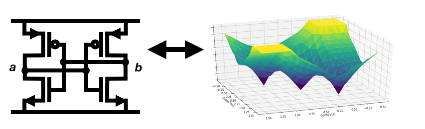
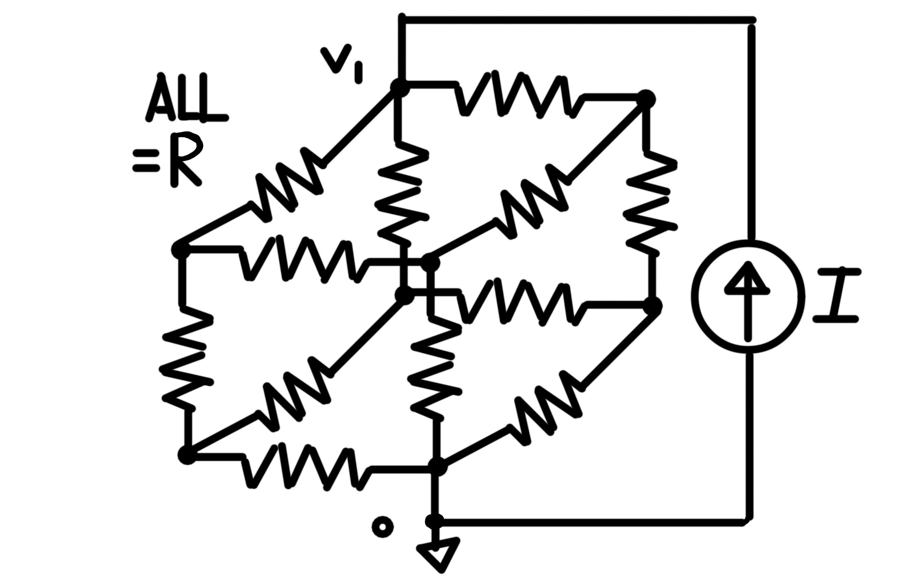
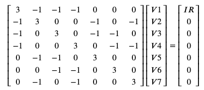
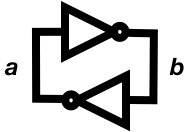
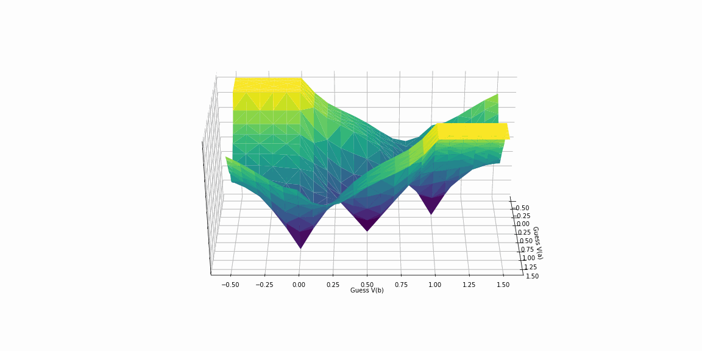
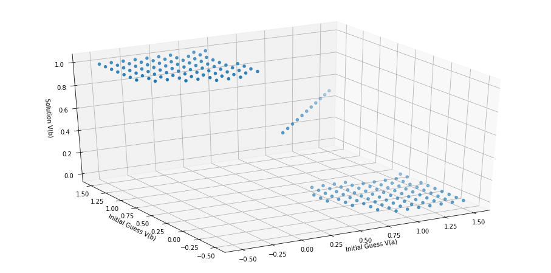

# Analog & Transistor-Level Simulation



Our last [*Software Makes Hardware*](https://medium.com/software-makes-hardware) chapter introduced the simulation model of most digital circuits: a combination of [event-driven and reactive](https://medium.com/software-makes-hardware/event-driven-reactive-hardware-a1fb8bc8d84d) logic.  Many circuits - including nearly everything *analog*, and most described at a *transistor-level*, don't fit this paradigm.  Predicting their behavior requires an entirely different view of how they work, which we'll refer to as a different paradigm or *model of computation*.  

This mode of circuit simulation is often referred to as [SPICE](https://en.wikipedia.org/wiki/SPICE), after the seminal program originally developed at UC Berkeley in the early 1970s.  In the decades since, much of the work in this in this area has retained a "spice"-suffixed naming convention - including all of the code shown here, available at [github.com/HW21/TeachSpice](https://github.com/HW21/TeachSpice). 


## The Analog Model of Computation

If you've taken freshman physics (and especially if you've studied electrical engineering), you've probably been asked to solve problems in linear circuits.  For example, let’s imagine a (somewhat) arbitrary network of resistors and current sources — such as this one:



Problem-statements are typically something along this lines of: *”given a set of component-values, what are the node voltages in this circuit?”.* (This particular circuit is of course not very arbitrary; it’s a common topic of interview problems and brain teasers.)

How would we put a program to the task of solving this sort of problem? First, recall how it went in physics class — i.e., how we’d proceed with pen and paper. We’d start by compiling a system of equations, with information coming from two sources:

* First, *Kirchoff's Laws* are re-statements of more fundamental physical laws.  Kirchoff's current law is a circuit-focused restatement of conservation of charge.  The voltage law similarly captures conservation of energy, particularly electrical potential energy. 
* Second, the circuit's *components* provide voltage-current relationships between their terminals.  Ohm's Law is probably the best known, describing the `V=I*R` relationship of a resistor.  Voltage and current sources have even simpler descriptions, of the form `V=V0` and `I=I0`.  More complex devices, including nonlinear elements such as diodes and transistors, and dynamic elements such as capacitors and inductors, add a few wrinkles covered in later sections. 

There are more than a few ways to combine these into a soluble system of equations.  In the popular *nodal analysis*, we write an equation expressing KCL at each node, incorporating the device equations along the way.  For the resistor-cube problem, the circuit equations look something like:

```
# Defining G === 1/R

I = G(V1-V2) + G(V1-V3) + G(V1-V4)
G(V1-V2) = G(V2-V5) + G(V2-V7)
G(V1-V3) = G(V3-V5) + G(V3-V6)
G(V1-V4) = G(V4-V6) + G(V4-V7)
G*V5 = G(V2-V5) + G(V3-V5)
G*V6 = G(V3-V6) + G(V4-V6)
G*V7 = G(V2-V7) + G(V4-V7)
```

This is the analog model of computation: it sees a circuit as, more or less, boiling down to a math problem.  

The simulator's job is therefore to create and solve a system of equations.  That solution corresponds to a physically-consistent set of values for the circuit variables.  

## Linear Solutions 

The class of *linear* circuits correspond to linear systems of equations.  Efficient means of solving such systems generally use a matrix formulation.  We can rewrite the resistor-cube system in matrix form as:



In principle, we can solve any such system symbolically, for any linear circuit and set of parameters.  Libraries such as Python's [SymPy](https://www.sympy.org) have built-in symbolic solvers for exactly this sort of problem: 

```python
import sympy as sp
import numpy as np

IR,v1,v2,v3,v4,v5,v6,v7 = sp.symbols('IR,v1,v2,v3,v4,v5,v6,v7')
lhs = np.array([
          [ 3,-1,-1,-1, 0, 0, 0],
          [-1, 3, 0, 0,-1, 0,-1],
          [-1, 0, 3, 0,-1,-1, 0],
          [-1, 0, 0, 3, 0,-1,-1],
          [ 0,-1,-1, 0, 3, 0, 0],
          [ 0, 0,-1,-1, 0, 3, 0],
          [ 0,-1, 0,-1, 0, 0, 3]
    ],)
A = sp.Matrix(lhs)
b = sp.Matrix([[IR],[0],[0],[0],[0],[0],[0]])
vs = sp.linsolve((A,b),(v1,v2,v3,v4,v5,v6,v7))
```

This yields:

```python
vs
[5*IR/6, IR/2, IR/2, IR/2, IR/3, IR/3, IR/3]
```

These results are in line with more common [intuitive solutions](http://web.physics.ucsb.edu/~lecturedemonstrations/Composer/Pages/64.42.html) of the resistor-cube problem, which typically look for the `5*R/6` equivalent-resistance between nodes zero and one.  Sympy was kind enough to give us the other six node-voltages for free.  (They also line up with the intuitive method.) 

In practice, this sort of symbolic analysis is [pretty, pretty rare](https://www.youtube.com/watch?v=O_05qJTeNNI).  Both the matrix inversion and symbolic solution prove aways too costly for all but the smallest toy-circuits.  Instead, numeric values are adopted for parameters and component values (and therefore, the matrix elements), and numeric techniques are used to find solutions.  For example, with the (sole) parameter value of `I*R=1.0V`, we can use numeric solvers such as `numpy.linalg` to solve the same system: 

```python
rhs = np.transpose(np.array([1,0,0,0,0,0,0]))
vn = np.linalg.solve(lhs, rhs)
```

This yields:

```python
vn 
array([0.83333333, 0.5       , 0.5       , 0.5       , 0.33333333,
       0.33333333, 0.33333333])
```

Which squares with the symbolic analysis as well as the [intuitive solutions](http://web.physics.ucsb.edu/~lecturedemonstrations/Composer/Pages/64.42.html). (Although no practical circuit-solver would use the dense-matrix methods of `numpy.linalg.solve`; instead [sparse matrix](https://en.wikipedia.org/wiki/Sparse_matrix) methods are essentially universal.)


## Non-Linear Circuits and Systems 

While this method works for linear circuits, most circuits of practical interest are non-linear.  The most common silicon components: transistors, diodes, and the like, are all inherently non-linear.  The most basic description of the MOS transistor, codified in SPICE's level 0 model, is multi-variate, non-linear, and defined piece-wise:

```python
if vov <= 0:  # Cutoff
  ids = 0
elif vds >= vov:  # Saturation
  ids = self.beta / 2 * (vov ** 2) * (1 + self.lam * vds)
else:  # Triode
  ids = self.beta * ((vov * vds) - (vds ** 2) / 2) 
```

*(Early in my career I was advised to repeat this in front of the mirror every morning.  Turned out to be decent advice.)*

Inserting such a component into our linear solver causes it to fall flat on its face.  

### Example: A CMOS Latch


As a central example, let’s look at a nearly-ubiquitous four-transistor circuit.  This *CMOS latch* is most commonly used for creating a single bit of memory.  Something like it forms the core of every bit of [SRAM](https://en.wikipedia.org/wiki/Static_random-access_memory), every bit of [cache](https://en.wikipedia.org/wiki/Cache_(computing)), and every [flip-flop](https://en.wikipedia.org/wiki/Flip-flop_(electronics)).  The computer you’re using right now includes at least a few million (and likely a few billion) instances.

This circuit works by cross-coupling two [CMOS inverters](https://en.wikipedia.org/wiki/Inverter_(logic_gate)) in a positive feedback loop.  In terms of boolean logic gates, we can represent it as such:



And in even simpler ([reactive](https://en.wikipedia.org/wiki/Reactive_programming)!) code: 

```
a = ~b
b = ~a
```

Note there are two valid states of `(a, b)`: either `a` or `b` can be `True`, so long as the other is its logical opposite.  The two states `(True, False)` and `(False, True)` represent the two boolean states held in this single-bit memory.  

Also note that nothing shown so far allows updating (or even initializing) the values of `a` or `b`.  In practice, additional bits of circuitry (or code) would make this possible. 

Despite its simplicity, this circuit features many of the aforementioned complications.  All of its components are non-linear.  It requires a (small) matrix solution.  And we *know* it has more than one solution.  Linear matrix solvers don't have much change of finding either solution.  Instead we'll need a class of nonlinear solver using *iterative* techniques.  

## Non-Linear Solutions in 1-D

Temporarily setting aside the matrices and circuits, we'll step down to single-dimensional problems to introduce iterative non-linear solvers.  Among the most common, oldest, and most popular such algorithms is the [Newton–Raphson method](https://en.wikipedia.org/wiki/Newton%27s_method). 

Iterative methods work something like a “hot/cold” game, operating on a sequence of guesses. For example, imagine attempting to find the square root of two, equipped only with multiplication (and hence the ability to take squares). The guessing game could go something like:

```
Guess   Guess^2    Hot/Cold
-----   -------    ---------
1       1          Too Low!
100     10,000     Too High!
50      2500       Too High!
20      400        Too High!
10      100        Too High!
5       25         Too High!
2       4          Too High!
1       1          Too Low!
1.5     2.25       Too High!
1.25    ...
```

Even using this extra-wide range of guesses (and a fairly arbitrary path through their updates), we can see this is quickly converging towards the right answer, roughly 1.414.  

Newton’s method provides a systematic means of updating our guesses.  Each recursive update takes the form:


*([Courtesy: Wikipedia](https://en.wikipedia.org/wiki/Newton's_method))*

Applying Newton’s method to the square root of two, we first cast an expression in the form `f(x) = 0`:

```
f(x) = x**2 - 2 = 0
df(x)/dx = 2x 
```

Applying its update algorithm gives us a bit more scientific sequences of guesses.

```
x_k     f(x_k)   f'(x_k)    x_k+1
------- ------   -------    -----
1.0      -1       2.0       1.5 
1.5      0.25     3.0       1.41667
1.41667  0.0069   2.8333    1.414215
```

We can see how quickly this is converging towards `sqrt(2)`. 

Iterative methods come with a few built in problems.  First, there is no a priori definition of when we are *done*.  How close is close enough?  In general - unlike the canned square root of two case - we don’t have the right answer lying around at hand.  (The problems wouldn’t be much worth solving if we did.)  Iterative methods therefore require *convergence criteria*.  Typical criteria check that successive guesses have changed by sufficiently little, i.e., that `x_k+1 - x_k < (some amount)`.  Fancier criteria include an absolute error check, i.e., a goal that the value of `f(x)` be sufficiently close to zero.  SPICE users will be familiar with parameters of the form `reltol` and `abstol` (and family), short for relative and absolute tolerance, which serve as controls for these convergence criteria. 

Second, iterative methods will not necessarily converge - even if there is a right answer.  Newton-Raphson and similar methods generally require a set of heuristics to help their chances.  For many functions, Newton-style methods can succeed or fail based on a single crucial parameter: the initial guess.  Circuits produce these situations all the time.  Veteran circuit simulators will recognize these as *convergence failures*, usually packed with cryptic error messages (sometimes including at least *something* about “convergence”).  Analog pros are used to applying a common set of simulation-tricks to make these go away. 

## Back To Matrices and Circuits

Having taken the aside to introduce a scalar iterative method, let’s return to our matrix formulation of circuits.  The matrix form of Newton’s method works (more or less) analogously to the scalar case.  

Our linear circuits produced matrix systems which we could express as:

```
G*x = s
```

Where:

* `x` is a vector of the circuit unknowns: node voltages, inductor currents, and the like
* `G` is a constant-valued matrix which describes the circuit, including the component connections and their values
* `s` is a constant-valued vector, generally including things like independent sources

The non-linear case, in contrast, requires adding a non-linear component we’ll call `Hg(x)`:

```
G*x + Hg(x) = s
```

Where `Hg(x)` is a vector-valued function including all the non-linear component relationships.  

To apply Newton's method, we cast this non-linear matrix system into the form `f(x) = 0`:

```
f(x) = G*x + Hg(x) - s = 0
```

Finding an update criteria requires taking something like a derivative of this. This element-wise derivative of (vector-valued)`f(x)`is a matrix we'll call `Jf(x)`, often referred to as the [Jacobian](https://en.wikipedia.org/wiki/Jacobian_matrix_and_determinant).

```
Jf(x) = df(x)/dx 
      = G + Jg(x)
```

Where `Jg(x)`is the (element-wise) derivative of `Hg(x)`. Now we can apply the Newton update formula to `f(x)`with derivative `Jf(x)`:

```
x_k+1 = x_k - f(x_k) / Jf(x_k)
Jf(x_k) * (x_k+1 - x_k) = -1 * f(x_k) 
Jf(x_k) * dx = -1 * f(x_k) 
```

Where we have defined `dx === (x_k+1 - x_k)`as the change in guess between iterations. Funny enough, we find that each update requires solving a linear matrix system. (Conveniently we just sorted out how to do so.) Other than that, this looks very much like the scalar Newton case. We have to evaluate:

* (a) the function to be zeroed, evaluated at our last guess, and
* (b) its "derivative", also evaluated at our last guess

And then make an update proportional to their ratio.  The primary complication is that while computing `f(x_k) / f'(x_k)` just required a single division, computing the matrix-analog `f(x_k) * inverse(Jf(x_k))` would either require a costly matrix inversion, or a solution to a linear system of equations. 

In general, non-linear matrix methods follow a simple set of steps: 

1. Take a guess of the circuit state.  
2. Check how close it is to correct.
3. If it requires refinement, linearize the circuit about the current guess.  Generally this involves computing the derivatives of the non-linear device equations. 
4. Calculate a change in guess, using something like the matrix-Newton approach outlined above. 
5. Repeat until convergence, or failure. 

## Back To The CMOS Latch 

How does a transistor-level solver see this circuit?  Again, more or less as a math problem:



*Figure A: CMOS Latch Contour*

Figure A is a result of [TeachSpice's](https://github.com/HW21/TeachSpice) `Countour` analysis, which sweeps the Newton-solver's possible guesses, and measures the estimation error `f(x_k)` at each.  The matrix solver does something akin to a gradient descent across this surface, starting from an initial guess and making its way towards one of the local minima. 

In other words, simulation starts by making something like this translation:


Note we have not two but *three* intersections with the z-axis.  In other words, this system has three solutions.  The three minima are located at roughly: 

* V(a) = VDD, V(b) = 0V, or `a=True`, `b=False`
* V(a) = 0V, V(b) = VDD, or `a=False`, `b=True`
* V(a) = V(b) = VDD/2, which has no digital/logical equivalent

Which of these solutions do we land on?   That largely depends on our initial guess.  



*Figure B: CMOS latch solutions, as a function of initial guess*

Figure B plots the solver's final value of one of the voltages (`V(b)`) as a function of the (two-dimensional) initial guess.  We see that the equilibrium we land in for `V(b)` is primarily dictated by the vicinity of that initial guess.  Guesses "near" `V(b)==0` tend to "fall into" its state, as guesses "near" `V(b)==VDD` tend to fall into its.  

Note Figure B actually includes a *fourth* possible result: in addition to the three equilibria, many initial guesses lead to *no solution*. These are examples of convergence-failure. While a more robust solver might correctly "pull in" more of them, it could not avoid them altogether.

Despite finding a third solution, don't expect this circuit to work very well as a [ternary](https://en.wikipedia.org/wiki/Three-valued_logic) (rather than binary) memory.  The third solution is an *astable equilibrium*, which the circuit cannot hold indefinitely - or even for very long.  Many iterations of this circuit include this third equilibria near `V(a) = V(b) = VDD/2`.  In a physical realization of this circuit - or a sufficiently high-fidelity model - the combination of inevitable device noise and the circuit's positive feedback quickly kick it out of this state, and towards one of the two stable equilibria.   

### Does Anybody Really Use This?

So: how does this analog-paradigm compare to the efficiency of the [reactive & event-driven paradigm](https://medium.com/software-makes-hardware/event-driven-reactive-hardware-a1fb8bc8d84d) for digital circuits?  In a word, **terribly!**

You'll notice that in contrast to the event-driven paradigm, this approach required a lot of, well, *math*.  The digital approach required basically none.  In fact, the math gets aways worse than we've shown.  You may have noticed that we've yet to encounter a common simulation variable: *time*.  Everything reviewed so far solves for *steady-state* circuit responses.  For SPICE users, this corresponds to the *DC* analysis.  For any circuit with dynamic elements - capacitors, inductors, and the like - finding a transient response modifies our system of non-linear *algebraic* equations into a system of (still non-linear) *differential* equations.  These systems generally have no closed-form solutions (even in principle) and require the addition of [numerical integration](https://en.wikipedia.org/wiki/Numerical_integration) methods.  These complications will be topics for future [SwMakesHw](https://medium.com/software-makes-hardware) chapters.

In principle, analog simulation can predict the behavior of complex circuits such as multi-billion transistor SoCs.  And in doing so, it reports the behavior at a level of detail that the digital paradigm doesn't even comprehend: terminal current-flows, power consumption, and arbitrarily-complex time-voltage waveforms.  

But in practice, the analog paradigm is *orders of magnitude* more computationally-intensive than its digital counterpart.  And the added fidelity largely goes to waste.  Analog simulation of billion-transistor circuits is akin to atomic-level simulation of, say, a bridge.  There is plenty more information generated at the atomic level than via abstractions such as *rigid bodies*.  But they fail to *help* in explaining the goals at hand: whether the bridge will stand or fall, or withstand a storm or earthquake.  The difference in computational complexity would not only be spent generating useless data, it would balloon the cost of the simulation past what a realizable computer (or even supercomputer) could complete.  In practice, both are dead on arrival.  This is a central facet of why analog lost. 

So where is this slower, more detailed paradigm used?  Primarily in two places:

* (1) On the class of circuits for which the digital paradigm breaks down.  We often call such things *analog circuits*, to indicate that *only* the analog paradigm successfully predicts their success or failure.  Common examples include amplifiers, data converters, wireless and high-speed transceivers (even those which transmit ostensibly *digital* data). 
* (2) On digital circuits, when two criteria are met:
* (a) The level or type of detail required surpasses the comprehension of the digital paradigm, and
* (b) The circuit is sufficiently small, to allow completion with practical compute resources

Our central example, the transistor-level CMOS-latch, is a common example of case (2).  While this circuit performs an outwardly digital function, only the analog paradigm predicts its inner behavior: how quickly bits can be stored and retrieved, mismatch effects between cells, and the like. 

