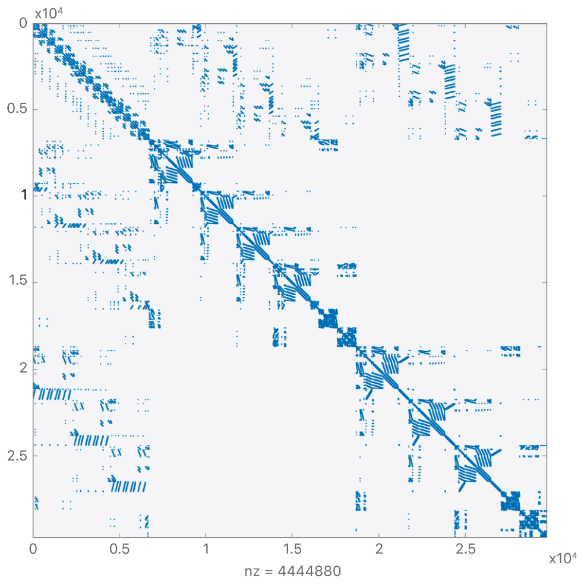
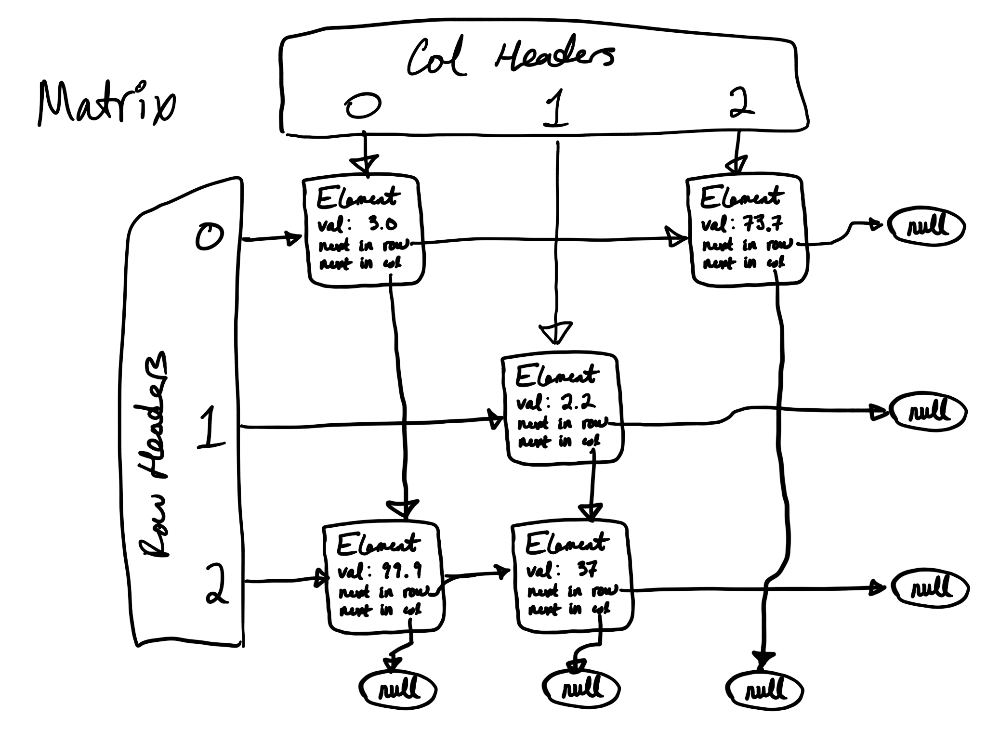

# Solving Sparse Matrix Systems in Rust 

And introducing [sparse21](https://crates.io/crates/sparse21) on [crates.io](https://crates.io/)


This chapter of [Software Makes Hardware](https://medium.com/software-makes-hardware) dives into two topics:

* Part 1 introduces sparse-matrix solvers: where they're needed, how they work, and popular algorithms & data structures that solve them efficiently. 
* Part 2 provides a short intro to the [Rust](https://www.rust-lang.org/) language, and surveys its pros & cons for the problem at hand. 

All of the code shown here is available in the [sparse21](https://crates.io/crates/sparse21) crate on [crates.io](https://crates.io/), Rust's built-in package repository. 

---


## Part 1: Sparse Matrix Solvers



*Figure 1: Example pattern of non-zero elements in a sparse matrix. Copyright [Apple developer documentation](https://developer.apple.com/documentation/accelerate/sparse_solvers?language=objc).*

Tons of physical problems boil down to solving systems of linear equations. In [a past chapter of SwMakesHw](https://medium.com/software-makes-hardware/analog-transistor-level-simulation-f15d2a233508), we introduced one such problem: (analog) circuit simulation. It can be broken into two areas: (a) linearizing non-linear systems of equations, and (b) solving those linear systems. Sparse-matrix methods are a powerful tool for part (b), along with a wide variety of other problems in the sciences, engineering, and graph analysis. 


### Linear Systems

For everyone who took enough math to see some [linear algebra](https://en.wikipedia.org/wiki/Linear_algebra), systems of linear equations will look familiar. A simple example looks something like:

```
x -  y +  z = 0
x -  y + 2z = 2
x + 2y + 2z = 1
```

These systems are efficiently cast in matrix form `Ax = b`, where `A` is a matrix, `x` is a vector of the unknowns (scalars `x`, `y`, and `z` in our simple example), and `b` is a vector of the right-hand side. Typical pen-and-paper methods for solving these systems use *Gaussian elimination*, applying a sequence of *elementary row operations*. In each step we'd do one of:

* Multiply a row by a constant
* Add a multiple of a row to another row

In most hand-solutions, recognition of *which* operations to perform is left as "an exercise for the reader". So how do we generalize to getting a program to make these decisions? 


### The LU Fairy

For starters, let's imagine that someone gave us two new matrices, `L` and `U`, where `L` is lower-triangular and `U` is upper-triangular, and `A=LU`. Would this make the problem any easier? We could re-state it as:

```
| l 0 0 | * | u u u | * | x0 | = | b0 |
| l l 0 |   | 0 u u |   | x1 |   | b1 |
| l l l |   | 0 0 u |   | x2 |   | b2 |
```

Where each `l` and `u`represents a non-zero element of `L` and `U`, respectively. Despite now having *two* systems to solve, both are really easy. We break down the system  `LUx=b` into two steps: `Ly=b` followed by `Ux=y`.  Starting with `Ly=b`, and renaming `l` entries with their zero-indexed locations, we have:

```
| l00  0   0  | * | y0 | = | b0 |
| l10 l11  0  |   | y1 |   | b1 |
| l20 l21 l22 |   | y2 |   | b2 |
```

From which we can almost directly read off a solution, starting by solving the first row: 

```
y0 = b0 / l00
y1 = (b1 - y0*l10) / l11
y2 = (b2 - y0*l20 - y1*l21) / l22
```

This solution-process is called *forward substitution*. In pseudo-Python code:

```python
for k in range(n):
  for j in range(k-1):
    b[k] -= L[k][j] * y[j]
  y[k] = b[k] / L[k][k]
```

Solving `Ux=y` proceeds along similar lines, which we call *backward substitution*:

```python
for k in reversed(range(n)):
  for j in range(k+1, n):
    y[k] -= U[k][j] * x[j]
  x[k] = y[k] / U[k][k]
```

Great, so that's easy. But where did these `L` and `U` matrices come from? The LU Fairy? Helpfully, the process of calculating an `L,U` pair from a nonsingular matrix `A` has a long and established history. This process is known as [LU factorization](https://en.wikipedia.org/wiki/LU_decomposition). Popular methods are attributed to [Crout](https://en.wikipedia.org/wiki/Crout_matrix_decomposition), [Doolittle](https://en.wikipedia.org/wiki/LU_decomposition#Doolittle_algorithm), and Gauss. Gauss's method, which is used in [sparse21](https://crates.io/crates/sparse21), works down the diagonal of A, transforming a row-column pair at a time. Pseudo-code for Gaussian LU is surprisingly simple:

```python
for k in range(n):
  for j in range(k, n):
    u[k][j] = a[k][j]
  for i in range(k+1, n):
    l[i][k] = a[i][k] / u[k][k]
  for i in range(k+1, n):
    for j in range(k+1, n):
      a[i][j] -= l[i][k] * u[k][j]
```

Perhaps least intuitively, this Gaussian method of LU factorization turns out to be exactly the same as (systematized) [Gaussian elimination](https://en.wikipedia.org/wiki/LU_decomposition#Algorithms). On more inspection, this should make some sense; the steps of Gaussian elimination are designed to zero-out the entries below the diagonal in each column, essentially upper-triangularizing the system. Each of these EROs corresponds to a multiplication of both `A` and `b` by a simple matrix, the products of which turn out to modify the system into the form `U*x = inverse(L)*b`.


## Pivoting

Thus far we've ignored the subjective-seeming decisions about *which* row operations to perform, in which order. These choices form a central complication in practical solvers, generally referred to as a need for *pivoting*. For example if we apply Gauss’s method to this matrix-system: 

```
1 -1  1 = 0
1 -1  2   2
1  2  2   1 
```

In our first step, we'd subtract the first row from the second and third. Then we're left in this state:

```
1 -1  1 = 0
0  0  1   2
0  3  1   1 
```

Which produces a real problem. Our next step includes dividing by the middle value on the diagonal, which is now unfortunately zero. The way around is simple enough: we can swap rows or columns to bring a more viable element to this pivot location. In this simple case, swapping the second and third rows offers such a cure. These row and column swap operations are generally known as *pivoting*. Row-swaps are third form of ERO, which also requires a reordering of the right-hand side vector `b`. Column-swaps amount to a change of variables between elements in the unknown-vector `x`. 

While a zero-valued pivot constitutes game-over, pivot problems don’t stop there. If our pivot value was, say, 1e-31, we’d have to divide every element by it. This can often lead to substantial numeric precision losses. Choosing a pivot for accuracy generally boils down to choosing one of the largest (absolute) value elements available. There are a variety of popular pivoting methods which make different trade-offs between speed and numeric accuracy. Sparse-matrix methods introduce a third goal into pivoting schemes, that to maintain sparsity. It turns out the robustness, accuracy, and speed of matrix solvers largely boils down to how they tackle this pivot-selection problem. 


## Sparse Methods 

Matrices representing physical systems, such as the example shown in Figure 1, often have an overwhelming majority of zero-valued elements. We call these matrices *sparse* if, for size `n x n`, they have `O(n)` nonzero entries. Since LU factorization performs some work for every non-zero element, and really needs to do nothing for zero-values, this is a property we'd really prefer to take advantage of. [Sparse matrix](https://en.wikipedia.org/wiki/Sparse_matrix) methods capitalize on this low density by storing and operating on only the non-zero-valued elements of the matrix and assuming all others to equal zero. For a large matrix of, say, n = 1 million, this can mean the difference between a few million operations (doable) and a few trillion (often not). 

Electronic circuits serve as an illustrative example. A circuit of `(n+1)` nodes generates a matrix of size `n x n`. A non-zero matrix element at location `(x,y)` generally represents a circuit-element connected between the two nodes `x` and `y`. In nearly all cases, the number of such connections is quite sparse - far closer to `n` than `n**2`. (The latter would require a component between every permutation of nodes, a rare sight.) Typical circuits might have between, say, `n` and `5*n` nonzero elements. 


### Orthogonal Linked Lists

We’ve now seen the key operations for LU factorization: pivoting via row and column swaps, and updating the element-values of sub-matrixes in the Gaussian inner loop. 

There are a few popular data structures for performing these operations on sparse matrixes. [Coordinate form](https://en.wikipedia.org/wiki/Sparse_matrix#Coordinate_list_(COO)) stores triplets of row, column, and value. The compressed [CSR and CSC formats](https://en.wikipedia.org/wiki/Sparse_matrix#Compressed_sparse_row_(CSR,_CRS_or_Yale_format)) compress these triplets into a set of more densely encoded, solver-efficient vectors. [Sparse21](https://crates.io/crates/sparse21) instead uses a data structure popular in many SPICE-like solvers, an [orthogonal linked list](https://www.oxfordreference.com/view/10.1093/oi/authority.20110803100255147). The OLL looks something like this:




*Figure 2: Orthogonal Linked List*

Each matrix-element is essentially a node in two separate linked lists: one over the elements in its row, and another over its column. Elements store two `next` pointers to either (a) another element in their row/column, or (b) a null-value. Header-vectors store the first elements in each row and column. An additional, unpictured vector of pointers to diagonal elements is maintained for quick access during solving. 

The OLL enables iteration over a row or column in linear-time with the number of row/column elements, typically a small number roughly independent of n. Swapping of either rows or columns only requires swaps of the `next` pointers in the orthogonal axis. Unlike most vector-organized matrix structures, the OLL has no *major* axis; rows and columns are on essentially equal footing. Perhaps most importantly, this symmetry enables flexible, fast, and intuitive pivot selection from any available element. Most row-major or column-major schemes either demand pivots be selected from a subset of elements (row-pivoting, column-pivoting), or at best require far more work to perform off-major-axis pivots. 


---


## Part 2: Rust 


*Rust's crustacean mascot [Ferris](https://rustacean.net/)*

### A Gentle Intro 

[Rust](https://www.rust-lang.org/) is a relatively new "systems-level" language originally created at Mozilla research. It's strongly and statically typed, and compiles directly to machine-code for raw-metal speed. While Rust guns for C-level performance, it also includes productivity-enhancing features like trait-based polymorphism, generics, and modern-grade ergonomics: package management, unit-testing, documentation, and the like. 

Rust's central goal of [fearless concurrency](https://doc.rust-lang.org/book/ch16-00-concurrency.html) is enabled in large part through its managing [memory-safety](https://hacks.mozilla.org/2019/01/fearless-security-memory-safety/) without a runtime [garbage collector](https://en.wikipedia.org/wiki/Garbage_collection_(computer_science)) - or any real runtime at all, for that matter. That may sound like a tall order, and is. The two most distinct ideas that Rust applies in its service are [ownership](https://doc.rust-lang.org/book/ch04-00-understanding-ownership.html) (which we'll cover) and [lifetimes](https://doc.rust-lang.org/1.9.0/book/lifetimes.html) (which we won't). 

#### Ownership

The [Rust book](https://doc.rust-lang.org/book/ch04-01-what-is-ownership.html) introduces its ownership concept as through three rules:

- Each value in Rust has a variable that’s called its *owner*.
- There can only be one owner at a time.
- When the owner goes out of scope, the value will be dropped.

This combination of facts is central to Rust's memory-safety. It can also uproot a lot of intuitions about which programs will succeed and fail. For example, this won't compile:

```rust
fn main() {
  let a = String::from("Hello World!");
  let b = a;
  printin!(“a is: {}”, a) // Fail! Ownership transferred to `b`.
}
```

Multiple-access data operates through a [borrowing system](https://doc.rust-lang.org/book/ch04-02-references-and-borrowing.html) of references. The most in-your-face facet of the Rust compiler is its *borrow checker*, which enforces a stringent set of borrowing-rules. At any given time, an object may have either (a) one or more immutable references, *or* (b) one (and no more) mutable references. 

#### Enums

Rust includes an enumeration unlike those in most languages. Rust `enums` operate more like C's `union`, holding one of an enumerated set of *variant* types, in which each variant can have an arbitrary amount of underlying data. A central example is the built-in [Option](https://doc.rust-lang.org/rust-by-example/std/option.html):

```rust
enum Option<T> {
  Some(T),
  None
}
```

Each `Option` holds either an object of parameterized type `T`, or `None`. One of the Rust compiler's most helpful features is that it *forces* handling of all possible cases, everywhere that an `enum` value is encountered. Programmers from dynamic languages such as Python and JavaScript will be all too familiar with errors along the lines of `NoneType has no attribute xyz`. 

```python
def address(person:Person) -> Optional[Address]: 
  # "Optional" means this returns "either Address or None"
  if some_condition: return None
  # ...
  return Address(...stuff)
jims_zipcode = address(jim).zipcode 
# Oops! What if that returned `None`? 
# Happens all the time...
```

In memory-unsafe languages, these sorts of bugs have even more painful repercussions. At best they throw a program-terminating exception. Just as likely they yield garbage-valued data. The Rust compiler won’t let you screw up this way. It enforces checking for each `enum` variant everywhere the `enum` value is accessed. The idiomatic form uses Rust's pattern-matching facilities, by way of its `match` statement. 

Rust also uses its `enum` construct where many languages would use exceptions. Instead of the implicit return-path via exception throwing, Rust functions typically return a `Result<T,E>`, an `enum` which holds either a successful return value (`T`) or an error (`E`). 


### Linked Lists: Rust's Least-Favorite Thing

Rust's ownership and borrowing rules make a linked list (and *especially* a doubly linked-list) one of Rust's least-favorite, most written about, and most puzzled-over bits of code. Stack Overflow questions, [official language-forum](https://users.rust-lang.org/) posts, and even [books](https://rust-unofficial.github.io/too-many-lists/) abound with new entrants trying to make these work. Most answers include a combination of [Box](https://doc.rust-lang.org/stable/rust-by-example/std/box.html) (essentially a smart heap-pointer) or the reference-counted shared-pointer [Arc](https://doc.rust-lang.org/std/sync/struct.Arc.html), and [RefCell](https://doc.rust-lang.org/book/ch15-05-interior-mutability.html) (which I don't entirely follow). 

Instead of these combinations of built-in pointer types, `sparse21` uses internally defined “pointers” to its elements, called element-indices, or `Eindex` for short. Each `Matrix` has a random-addressable data structure (Rust's built-in `Vec`) which owns the elements, and accompanying code which assigns their indices. Essentially everything else in the library operates on `Eindex`. An OLL-matrix and its `Elements` then look something like so:

```rust
struct Element {
    index: Eindex,
    row: usize, col: usize, val: f64,
    next_in_row: Option<Eindex>,
    next_in_col: Option<Eindex>,
}

pub struct Matrix {
    elements: Vec<Element>, // owner of all `Element`s.
    // Everything else gets referenced via `Eindex`es.
    row_hdrs: Vec<Option<Eindex>>,
    col_hdrs: Vec<Option<Eindex>>,
    diag: Vec<Option<Eindex>>,
}
```

Like most compilers, Rust's thrives on identifying violations of its type system. Deriving maximum value from its feedback then largely stems from arranging common bug-types into type-system errors. For example, element "pointers" which can be null are designed to be different *types* from pointers which cannot. For `sparse21` elements, these known-valid pointers are of type `Eindex`, and potentially-null pointers are `Option<Eindex>`. Each `next` attribute is an `Option<Eindex>`, as are the entries in the row and column-header vectors.`Option::None` represents the null element-pointer, used for terminating each of the lists and representing empty rows or columns. 

Rust's `Vec` proves a somewhat unhappy companion for the task of storing matrix elements, largely due to its interaction with the borrowing rules. Borrowing any element of a `Vec` counts as a borrow of *the entire* vector. It’s highly common for matrix elements to, for example, look at the value of one element and add or multiply it to the value of another. Borrowing rules prevent this; the “look” constitutes an immutable borrow, and the “update” a simultaneous mutable borrow. This forces element-value operations to seemingly over-rely on indexing into the matrix; temporary references to elements don’t fly. For example, the inner loop of row/column elimination looks something like:

```rust
self[ps].val -= self[pu].val * self[pl].val;
psub = self[ps].next_in_col;
plow = self[pl].next_in_col;
```

It may seems attractive to pull `self[ps]` and `self[pl]` out into local variables. But doing so would prevent us from modifying the element `self[ps]`. (As is, this still only works because the `val` attributes support the `Copy` trait.) `Vec` has these rules for good reason; vectors can change size and capacity at runtime, often reshuffling their memory locations in the process. Memory references to elements could be left dangling in the process. A custom container for matrix-elements would could around this, but is beyond our current scope. 

More relevant, these mental-machinations are good examples of Rust's learning curve. There are tons of popular patterns which Rust really discourages. Picking it up requires wrapping your head around not just its syntax, but a fairly different mental model of what is easy, hard, and impossible. 


### So, Is Rust Good?

For a library like `sparse21` which doesn’t take advantage of the concurrency features, many of Rust's benefits are muted. (Building around a data structure which fights the borrow-checker doesn't help either.) Larger applications of `sparse21` should offer some more opportunity to benefit from Rust's fearless concurrency. 

More generally, there’s an opportunity at the bottom of the language-stack. Despite numerous reports of their death, tons of C and C++ code is being written around the world. We got a reminder during this week's Super Bowl, in what amounted to a high-publicity recruiting pitch:


I wouldn’t recommend Rust as a replacement for more productivity focused languages (e.g. JavaScript, Python), unless it's specifically for dramatic changes in performance. But if you think you need C or C++, then Rust is worth a look. Case in point, one of the first replies to Elon was this:


("Rustaceans", as enthusiasts call themselves, are sort of like the Bernie-bros in this sense. They'll get online and make themselves heard. It's a lot harder to imagine such Tweets advocating for, say, C or Joe Biden.)


### Embed-ability

In addition to needing high performance, many low-level libraries benefit from sharing across languages. [ZeroMQ](https://zeromq.org/) is a prominent example. The core *libzmq* library is written in C, with thin bindings to [just about every programming language you can name](http://wiki.zeromq.org/bindings:_start). Along with its raw speed, this is one of C’s remaining great advantages: it compiles to machine code with no accompanying run-time side-car, and a near-hardware memory model. This bare-minimum execution model makes it amenable to embedding in just about any language, no matter how high or low-level. No matter how uncool, C remains the king of these embedding applications. This is a space where Rust has real merit and real opportunity. 


### Some Closing Pros & Cons

The good:

- Fast. Like raw-metal fast.
- Embed-ability: amenable to plugging into other languages
- Trait-based polymorphism, `enum` based error handling
- Modernity of package management ([cargo](https://doc.rust-lang.org/book/ch01-03-hello-cargo.html), [crates.io](https://crates.io/)), [unit testing](https://doc.rust-lang.org/book/ch11-01-writing-tests.html), [documentation](https://docs.rs/) 
- Momentum! 

The bad: 

- Definitely a new mental model, with fairly high "fussiness"
- Early-days-grade ecosystem
- Slow compilation
- Nerds on the internet telling you to use Rust
- Prospect of becoming a nerd on the internet telling people to use Rust 


---


*[Software Makes Hardware](https://medium.com/software-makes-hardware) is a dive into how silicon and electronics get designed, for the software-engineering inclined. (It turns out we're not so different after all.)*

