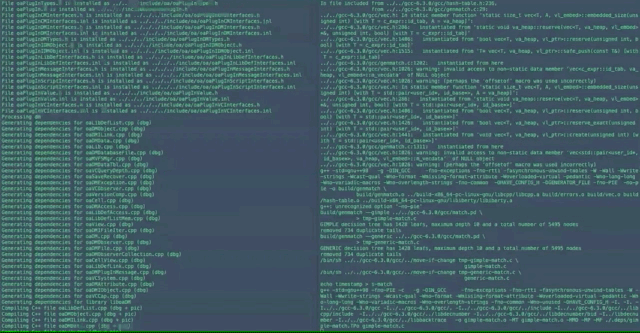
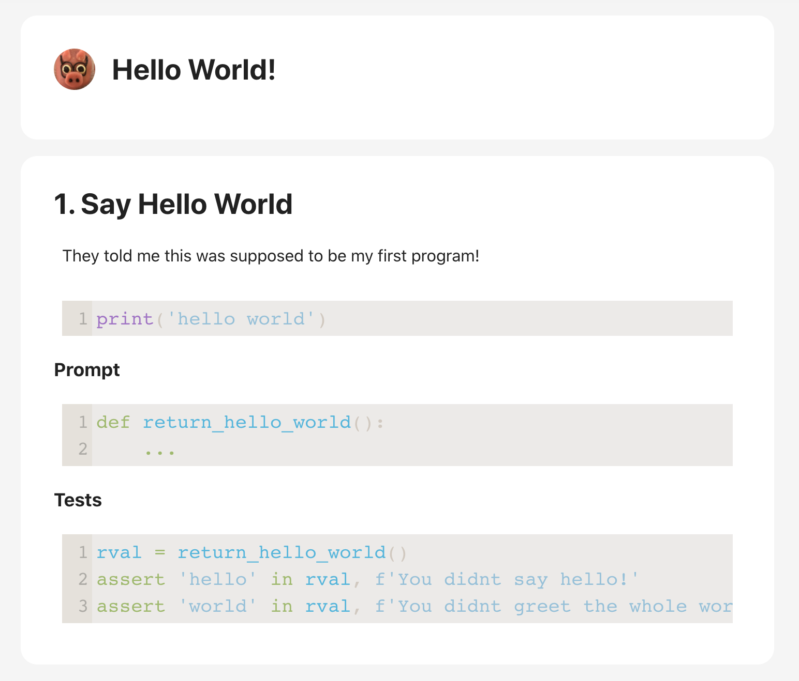
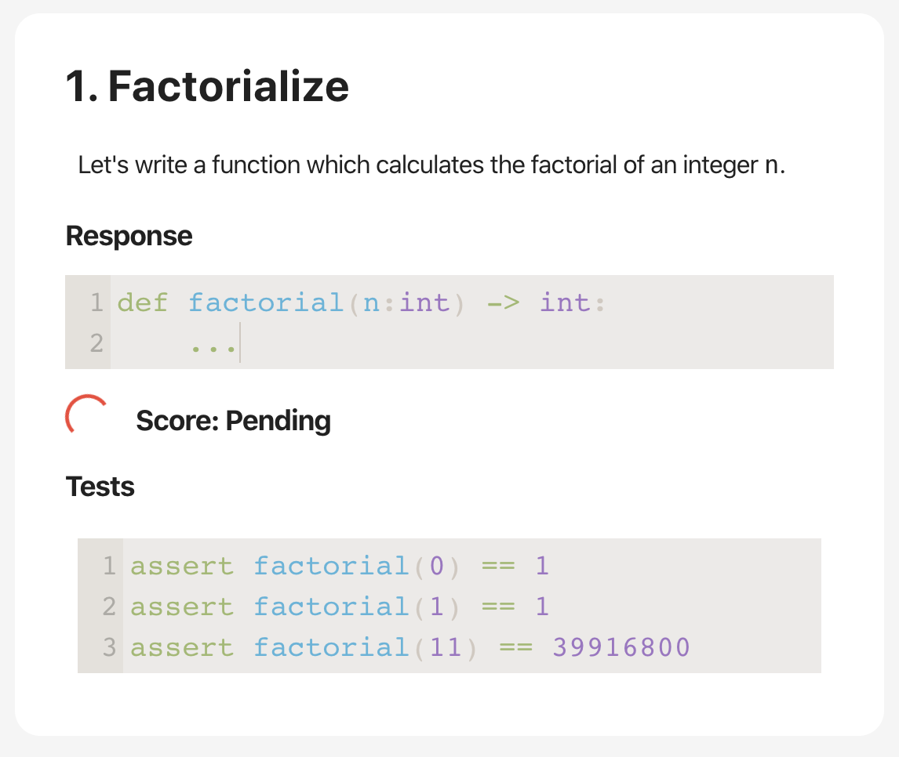
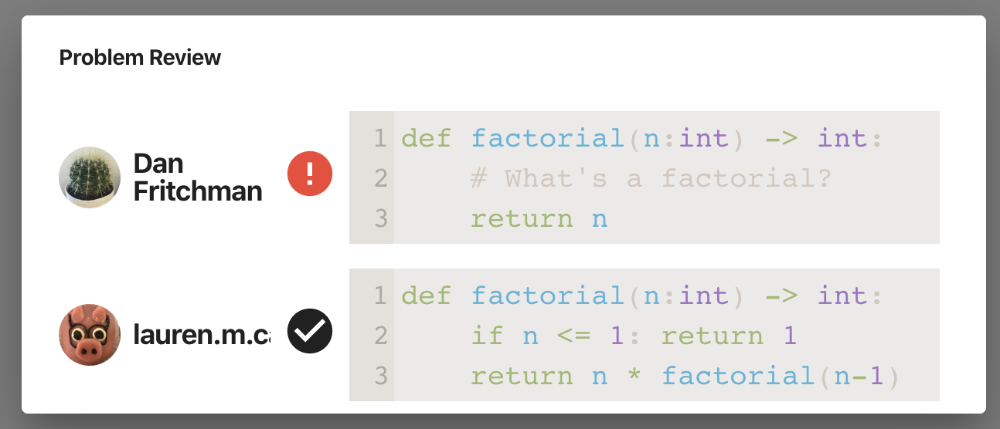
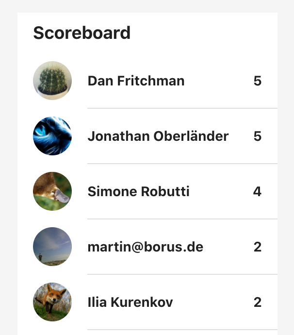
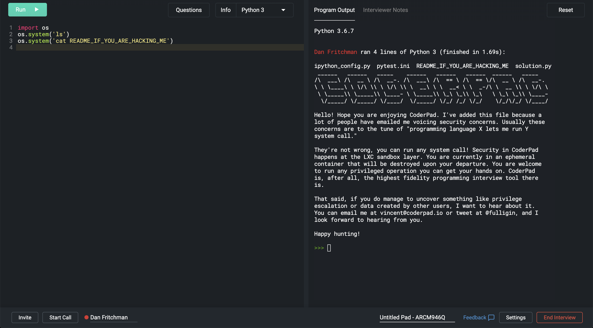

# Open Source, Live, Notebook-Based Teaching & Learning

Introducing [KlassLive](https://github.com/HW21/KlassLive)


Before COVID-19 made Zoom-teaching synonymous with, well, teaching, the future of education appeared to consist of (a) uploading videos online, and (b) sitting back and letting people watch them. The most prominent examples have been MOOCs: massive open online courses, designed to expand reach by orders of magnitude to thousands of new learners. While MOOCs have dramatically expanded access to all sorts of content, it's hard to find any given *learner* getting more out of the MOOC format than more traditional, personal methods. 

In that sense, Zoom and MOOCs have a few lessons to share. First, live-learning eats pre-recorded-learning's lunch. Interacting with people matters. Second, interactive-learning eats passive-learning's supper. *Doing stuff* rather than passively listening *really* matters. Combining the two is especially powerful. Organizations such as [Lambda School](https://lambdaschool.com/) and Stanford's [Code in Place](https://engineering.stanford.edu/news/free-coding-education-time-covid-19) have made the realization that being *online* does not necessarily mean asynchronous, pre-recorded, and passive. 

Note by *teaching & learning*, we mean something that extends aways beyond traditional education. Think of all the adults trying to convey information to one another at professional conferences, in corporate training sessions, product demonstrations, and the like. These sessions tend to succeed at being live, but have a much harder time being particularly interactive, for understandable reasons. Technical sessions - those introducing pieces of software, or ideas in engineering or math - have a tougher time interactify-ing than, say, the philosophy of Nietzsche or Spinoza. The latter just requires people talking; the former requires some non-zero amount of techno-stuff. 


## Interactive Learning: Some Problems

First, everyone needs a sufficiently-similar environment to live-interact *in*. Generally this means learners' first steps are installing or setting up some piece(s) of software. Modern programming languages make this easier with sophisticated package management. Topics like my own specialty (hardware) often require a lot more pain. Installation can be time-consuming, and worse require a long cascade of undocumented pre-req steps. 



*Who TF signed me up for this?*

Often half an audience is lost before even getting started. *At best*, these setup-steps take time away from what everyone should be spending their time on - the content they want to learn.


### Keeping Up, Or *Who's Getting What*

Second, building a complex narrative generally requires a series of incremental steps. Lessons then take  the character of a series of accumulating stages, starting with something relatively simple such as: 

```python
def step1(monkey):
    """ Let's write a function 
    that turns a monkey into a wrench. """
    return ...
```

These simple beginnings could then build into increasingly elaborate lessons:

```python
def step2(monkey):
    """ Now write a function that uses step1 
    to turn a monkey into a whole garage. """
    wrench = stage1(monkey)
    return ...
```

Many steps later, this can add up to something fairly complicated: 

```python
def step73(monkey):
    """ Write a function that uses steps 1-72,
    to recreate the origins of the universe. """
    after_big_bang = stage72(monkey)
    return ...
```

Problem is, once any of steps 1 through 72 go wrong, step 73 is a lost cause. Worse yet, instructors only have crude feedback mechanisms to establish who is getting what, and keeping up at each stage. 


## The KlassLive Method

KlassLive was born of seeing too many of these interactive sessions go wrong. It's built on a few principles designed to get learners up and running ASAP in a fun, interactive environment. 


### No Setup, No Installation, Ever

KlassLive learners need one piece of information: a URL. They join live sessions via GitHub login and immediately enter a working environment prepared for the topic at hand. 

Hosts create these reusable environments beforehand, using Jupyter style notebooks and container technologies to specify and isolate their dependencies. 


 


Each Klass looks much like a Jupyter notebook. Hosts prepare a series of cells including a combination of code and markdown-based description. Each section then ends with a problem, including a code prompt for students, a set of auto-graded tests, and a (hidden) instructor-provided solution. Submissions are executed and graded on a back-end server environment configured by the host. 






### Keeping Up

KlassLive session-hosts can review and compare each participant's responses, either in public or private, to understand who's getting what. Each participant can use either past *solutions* or their own past responses to sequentially building problems. Incorrect solutions are automatically replaced with the solutions. Nobody is left behind at any point. 





### Fun!

Finally, KlassLive makes these sessions an interactive learning game. Responses are graded by instructor-provided methods, which can include metrics for breadth of correctness, execution time, and code density. A live scoreboard tracks where everyone stands, and allowed for rewards of the best answers over a problem or session. 




*(I Cheated)*


## The KlassLive Stack 

While Python was KlassLive's initially supported teaching & learning language, its implementation is built entirely in modern Javascript, atop a pile of incredible open-source software. While Jupyter is a significant source of KlassLive's inspiration, none of Jupyter's open-source code gets used under the hood. 

Building stuff like KlassLive is also not what I usually do. My day job is designing hardware, silicon, and the software that enables them. In walking through the KlassLive stack, I'll also share lessons learned adopting many of 2019's most popular web-app tools and libraries from the perspective of a fresh newcomer. 

KlassLive consists of three primary components: 

* A single-page front end using React and friends, 
* A GraphQL server, principally interacting with a MongoDB database, and 
* A submission-runner which executes and grades responses 

Authentication is managed by [Firebase](https://firebase.google.com/)'s integration with GitHub login. This was an element that I wanted absolutely no part of, and probably never will. While I found much of the Firebase ecosystem fairly wanting, its authentication support has been great. It's worked impeccably from day one with minimal custom code required. 


### Front-End

Of the mountain of OSS KlassLive relies on, perhaps no piece is more essential than [React](https://reactjs.org/). For several years I knew about two things about React: (1) Facebook makes it, and (2) I don't really like Facebook. Ergo, React irrelevant. Upon actually comparing 2019's popular front-end frameworks, it took about three pages of tutorial to dispel that sentiment. React's combination of state-machine-components and removal of template-programming through its JSX syntax pretty quickly made it clear why it's become the most popular way to build web UIs. Learning about React was really what made me believe making something like KlassLive was possible (for me). There's no going back. 

KlassLive also benefits from React's gigantic ecosystem. [Create React App](https://github.com/facebook/create-react-app) served as a project starter and navigation tool for JavaScript's fairly complicated cross-compilation systems. Nearly all of KlassLive's look and feel are created via [Material-UI](https://material-ui.com/), including all of the primary UI elements - problems, sidebars, menus, tables, and the like. Code-and Markdown editing can primarily be credited to the outstanding [CodeMirror](https://codemirror.net/), and to related libraries [react-codemirror2](https://github.com/scniro/react-codemirror2) and [react-markdown](https://github.com/rexxars/react-markdown). 

I have a more complicated relationship with the next-most impactful library in KlassLive's front end: [Redux](https://redux.js.org/). While React's local-FSM per UI component offers a quite intuitive organization of data and behavior, it quickly trips over widely-shared, mostly-global state. A family of state-management libraries have emerged around React, the most popular being Redux. All of KlassLive's central front-end data - code entered in cells, response scores, and the like, are kept in a Redux store. Its update mechanism, Redux's reducers, comprise a hefty chunk of the front-end codebase. 

Using Redux has not been my favorite part of writing KlassLive. I've tried alternatives, particularly [MobX](https://mobx.js.org/README.html), which appeared more intuitive. But Redux's giant community and knowledge base won the day. As a general principal, when in doubt KlassLive uses the most popular tools available per task. Above all else this makes help most readily available. 


### GraphQL

The link between KlassLive's front and back-ends uses another prominent Facebook open-source project: [GraphQL](https://graphql.org/). GraphQL is a strongly typed contract between client and server, which uses a simple query-description language to describe its types. For example each Klass class includes, among a few more-mechanical fields:

```graphql
type Klass {
    owner: User!,
    title: String,
    desc: String,
    problems: [Problem]!,
    scratch: [Cell],
    metadata: JSON,
    runtime: JSON,
    visibility: Visibility,
}
```


KlassLive uses the [Apollo GraphQL](https://www.apollographql.com/) combination of client and server-side libraries. A typical query for a Klass looks something like:

```graphql
query GetKlass ($id: String) {
  klass(id: $id) {
  	id
    title
    desc
    owner 
    runtime
    visibility
	  problems {
        title
        desc
        setup { ...CellData }
        prompt { ...CellData }
        solution { ...CellData }
        tests { ...CellData }
      }
      scratch { ...CellData }
  }
}
```


Where each `...CellData` is a GraphQL fragment, consisting of a re-used set of fields, in this case the cell's type, code, and meta-data properties. 

On the server, GraphQL executes through a series of resolver functions. Queries and mutations essentially fall through a tree of resolver function-calls, passing the results of each onto the next layer. Klass data is stored in a MongoDB instance running on MongoDb.com's Atlas service. The popular [Mongoose](https://mongoosejs.com/) object-document mapping library dictates the schema and provides a semblance of type-safety for the server-side code. 

Apollo also includes a set of scripts which generate [TypeScript](https://www.typescriptlang.org/) interfaces from GraphQL's schema description language. Besides this auto-generated code, TypeScript is largely a curiosity to KlassLive. Its classes are used in a few sections where I tended to screw up conversions between in-memory, on-wire, and in-database versions of similar data, such as the Klass notebooks. All in all, it's not clear whether it has helped or hurt. 


### Submission Runner

Each KlassLive submission is run and graded by a runner service, executing inside a host-dictated Docker image. Submissions are isolated from each other, their underlying host, and past invocations by creating new, ephemeral containers for each submission. Under the hood the KlassLive runner uses the [Dockerode](https://github.com/apocas/dockerode) Node package to start, execute, and track these containers. 

The public [Klass.Live](https://klass.live/) instance has materially different security needs than any local, private, or higher-trust environment. While restricted-access might limit usage to within a particular company, school, or domain, the public Klass.Live aims to enable anyone with a GitHub account. Safely running arbitrary code from near-arbitrary users is its primary security hurdle. A variety of online IDEs, coding challenges, and other programming tools such as [CoderPad](https://coderpad.io), [CodeSandbox](https://codesandbox.io), [CodePen](https://codepen.io), [CodeBunk](https://codebunk.com), [repl.it](https://repl.it), [CoderByte](https://www.coderbyte.com), and Google's [FooBar](https://www.google.com/foobar) all find different solutions. CoderPad, for example, semi-prominently includes a "readme if you're hacking me" file in its interactive interview sessions, which run on isolated cloud VMs. 





The public Klass.Live's Docker containers are executed by Google's [gVisor](https://gvisor.dev/) runtime. This is the same protection Google Cloud Platform offers its own App Engine environments. gVisor is essentially a proxy for a portion of the Unix interface, designed to limit its attack surface. 

gVisor's security comes at some cost. First it adds a performance overhead above and beyond that already incurred by container runtimes. For short and simple problems this doesn't mean much, but for more complicated Klasses it adds up. Second, for very [Berkeley-related](https://www.chisel-lang.org/) reasons, [Scala](https://www.scala-lang.org/) is among KlassLive's high-priority languages. Unfortunately I've found gVisor to play particularly poorly with its Java-based stack, particularly for larger, more memory-intensive programs. Private instances of KlassLive can avoid these overheads and problems by instead running in the default Docker runtime. 


### Roads Not Taken

Along the path of building KlassLive, a few high-potential tools were also tried and abandoned. Probably most prominent is Vercel's [NextJs](https://nextjs.org/). While Next's primary contribution is in extending React's component lifecycle to include server-side rendering, I found it attractive for different reasons. The most-popular method for intra-app routing in React uses component-based routers, such as those from the popular [React-Router](https://reacttraining.com/react-router/). KlassLive's top level, for example, looks something like:

```jsx

class KlassLiveRouter extends React.Component {
    render() {
        return (
            <Switch>
                <Route path="/" exact component={HomeContent}/>)}/>
                <Route path={`/account`} exact component={UserPage} exact={false}/>
                <Route path={`/klass/:id`} component={KlassMatcher} exact={false}/>
                <Route path={`/session/:id`} component={SessionMatcher} exact={false}/>
                <Route component={NotFoundContent}/>
            </Switch>
        );
    }
}
```

Upon getting starting with React, I really didn't like this. I found Next's file-system-based routing aways more intuitive. But using Next proved much harder, particularly for such a noob. Its marriage of the *same* code running on both the client and server made things like initialization and setup aways more mind-bending. Attempts to pair this with [MobX](https://mobx.js.org/README.html) likely didn't help. While I think Next has something pretty cool on hand, when in doubt KlassLive defaults to the most popular, largest-knowledge-base options: in this case Redux and React-Router. 

Vercel's related [Now](https://github.com/zeit/now) service deserves additional credit, as it hosts the Klass.Live SPA, along with the [intro presentation](https://klasslivelightning.hw21.now.sh/) from PyConDe 2019, as well as my own [personal website](https://dan.fritch.mn/). Its serverless functions also run a limited-functionality version of the KlassLive GraphQL server. 


## Looking Forward

KlassLive is open-source for all to use, either directly or as the basis for other work. While we welcome contributions via GitHub pull requests, I won't be actively developing KlassLive in the immediate term. While I think there's a lot it can offer, I'll be on my day job [making the chips](https://medium.com/software-makes-hardware). In my first few months back in the academic world I've also realized some other pressing problems which the KlassLive stack might help - namely, reading and writing. 

Lastly, KlassLive owes thanks to much of the staff and start-up community at London's [Founders Factory](https://foundersfactory.com/), my temporary home away from home from summer 2019, who provided invaluable advice and encouragement, and to the enthusiastic audience at Berlin's 2019 installment of [PyConDE](https://de.pycon.org/). 


