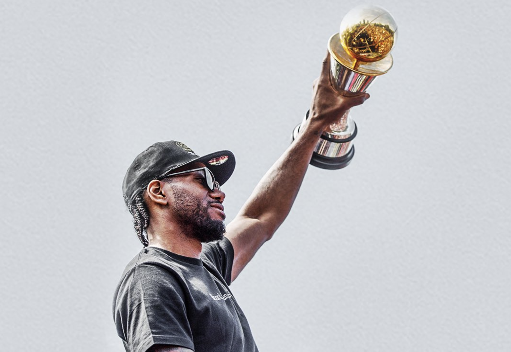
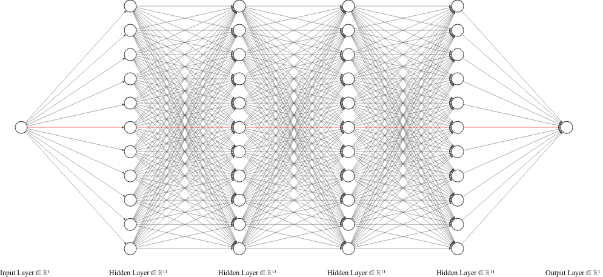

## Can {Player X} Lead A Team To An NBA Title? 



A deep learning, big data analysis. 

Using the latest advances in machine learning and artificial intelligence, leading experts at the University of California, Berkeley\* answer an age-old sports media question: *Can {Player X} Lead a Team to an NBA Title?*. 

A diagram of the neural network used to make these predictions:



> Red edges are for feature "MVP" and have weight 1.0.  All other edges have weight 0.0.  Shout-out [zfrenchee's diagramming tool](https://github.com/zfrenchee/NN-SVG).\*\* 

Advances in AI interpretability also generated a semantic description of this model:

```
Has {Player X} won the regular season MVP? 
```

### Yes, the AI is a Joke.

In case it didn’t land, everything about machine learning, AI, and interpretability here is a joke.  (Although it may still work better than many other ML-led investigations.)  

The real thesis: there is a single high-confidence predictor that {Player X} can lead a team to a championship: whether they have won the league's regular-season MVP.  


## NBA MVP: Basketball's Most Select Group

There's a simple qualitative case for the *MVPs Only* outlook.  Success in basketball generally requires great individual talent.  At the highest levels, it requires *historically* great individual talent.  And the NBA MVP is the best indicator we have of these historic individuals.  

The NBA's MVP is the sport's most elite club.  With only thirty-four members, it is among the most exclusive in all of sports.  More people have held the US presidency.  More people have been the King of England.  Over 10x as many are in the Basketball Hall of Fame, and nearly 20x as many have been to space.  In 2017, Donald Trump became America's 45th president - and Russell Westbrook became the NBA's 32nd MVP.  

Debates of whether {Player X} can lead a team to the title tend to focus on {Player X}s a notch or two below the MVP level: Damian Lillard, Carmelo Anthony, and a similar cohort of second tier stars.  *MVPs Only* has a simple answer for all of them: no.  


### Is it really this simple? 

Mostly.  Note that although ostensibly about players, *MVPs Only* really serves as a prescription for which *teams* have a chance to win the championship.  And since only one of the teams which *can* win each season's championship ultimately does, *MVPs Only* really only identifies the teams which it predicts cannot. 

So - how often has a this been wrong?  How frequently does a team without a regular-season MVP win the championship?  

* Once in the past 10 years
* Twice in the past 20 years 
* 3x in the past 30 years
* 6x in the past 60 years

About 90% of champions have needed a regular-season MVP.  Most machine learning models would be painfully jealous of this level of accuracy. 


### Past (Not Future) *MVPs Only* 

The past tense in the *MVPs Only* framing - *has* {Player X} won the MVP - is also relevant.  It is as if the MVP is a qualification on {Player X}'s resume when applying for the position of NBA Champion. 

Of the past sixty champions, only *one* featured a *future* league MVP, excepting teams who had another past winner.  (A second team, the league's newly-minted champion Raptors, may someday join them.) 

Players briefly playing "at an MVP level" also need not apply.  This phrase has come into vogue, particularly for describing short stretches of play.  Typical usage means something like "if this level of play continues for most of a season, it would merit a realistic MVP bid".  This isn't enough.  In *MVPs Only* there is a simple and strict definition of "playing at an MVP level": winning the MVP. 


## Champions Without MVPs

The sixty-year history of exceptions to *MVPs Only* is short enough to review all six outliers. 

### 2019 Toronto Raptors

You may have noticed a prominent failure of *MVPs Only*: it missed the NBA's reigning champions, the 2019 Toronto Raptors.  

The Raptors are a particularly unlikely champion in *MVPs Only*'s framing, particularly because they were *led* by an unambigously best player, and that player has not won the MVP.

There are a few senses in which we might say a basketball team was *led* by a particular player.  Although every champion has several great players, most have an outwardly evident on-court pecking order.  No debate lingers about who *led* the 1998 Bulls, 2009 Lakers, or 2016 Cavaliers.  Fewer great teams are *led* by committee.  Champions with ambiguities in pecking order tend to have *all* of the leadership candidates at the MVP level: Shaq and  Kobe, Curry and Durant, Magic and Kareem.  But the smallest group of champions are those unambigously *led* by a single player, who was not a league MVP.  This has happened only twice: in 1975 by Rick Barry, and in 2019 by Kawhi Leonard. 

Leonard finished second in MVP voting in 2016, and third in 2017.  After an 2018 season lost to injury and a "load managed" 2019 regular season, Kawhi *played at an MVP level* throughout the 2019 playoffs.  He also has a perfectly good chance to win a future regular-season MVP.  The Raptors also saw their top-heavy Finals opponents met with unusually poor injury luck.  (Although many champions have seen similar benefits.)  Absent the Warrior's star injuries, it's likely *MVPs Only* would have prevailed again in 2019. 

The *MVPs Only* thesis existed long before Toronto won the 2019 Championship.  (Several drafts of this article did as well.)  Its publication coming shortly after one of its largest failures is somewhat intentional.  It adds an interesting question: how much to continue to trust sixty years of history, and how much to believe that things have changed. 


### 1989, 1990, & 2004 Detroit Pistons

Fully half of the exceptions to *MVPs Only* come from one franchise.  Maybe there's something in the water in Detroit, allowing the Pistons to win so (relatively) often without the highest level of individual talent. 

Led by Chauncey Billups, Ben Wallace, Rasheed Wallace, and Richard Hamilton, the 2004 Pistons are often cited as the canonical example of how to win a championship without a star.  These citations generally ignore that the 2004 Pistons are nearly the *only* example of a team pulling this off.  Comparisons to this team are frequent, perhaps primarily in projecting hope for teams lacking the typically-required individual talents.  Of all the NBA's champions, 2004 Detroit may have had the least high-end talent.  The four co-leaders (Billups, Hamilton, Wallace, Wallace) received a combined one MVP *vote* over the course of their careers, for Rasheed Wallace's lockout-shortened 1998-99 season with the Portland TrailBlazers.  

At least during their NBA Finals, the 2004 Pistons benefitted from a similar set of circumstances to the 2019 Raptors.  They faced a short-lived dynasty, seemingly on its last legs, at the end of a season mired by internal drama, lacking depth due to years of star acquisitions and role-player defections.  And perhaps most crucially, some of that top-heavy talent was injured for each NBA Finals. 

The 1989 and 1990 Pistons featured a similarly Hall-of-Fame-bound, relatively balanced cast, including Isaih Thomas, Joe Dumars, Dennis Rodman, and Bill Laimbeer.  While three are in the Hall of Fame, only Thomas ever cracked the top five in MVP voting.  

### The Late 1970s: The NBA's Weirdest Era 

* 1979 Seattle Supersonics
* 1975 Golden State Warriors 

Past articles have covered just how weird the 70s - especially the late 70s - were in the NBA.  

The 1975 Warriors were led by Rick Barry, a five-time All-NBA first team selection - roughly the tier just below MVPs.  He and Kawhi are the sole examples of non-MVPs *leading* their team to the championship, without an unusually egalitarian distribution of the team's workload. 

The 1979 Sonics, in contrast, were led by Gus Williams (1x first team, 1x second team), Dennis Johnson (1x first team, 1x second team), and Jack Sikma (no all-NBA).  They were closer to the 2004 Pistons in this regard. 

Both won in an era when the NBA was just not as good.  


## The Lone Future MVP: Larry Bird

Of past 60 champions, only the Shaq-Kobe Lakers, Duncan-Robinson Spurs, and 1981 Celtics featured a *future* MVP, who had not yet won.  The Lakers and Spurs complemented them with other *past* MVPs.  Only the 1981 Celtics were undisputably led by a future MVP, Larry Bird. 

Although not as crazy as the late 1970s, the 1981 season was pretty weird.  *Both* Western Conference finalists (Rockets and Kings) had losing regular-season records.  In the de facto NBA Finals, Boston completed a 3-1 comeback to beat Philadelphia in seven games.  Five of the seven were decided by two points or less.  The Celtics and 76ers also had the season's top two MVP candidates; Bird lost the voting to Julius Erving in one of the closest votes in league history.  Bird would go on to three MVPs of his own, winning consecutively in 1984, 85 and 86.  


## Borderline Cases

A few cases meet *MVPs Only*, but with potential caveats.  Most of these cases involve questions of who *led* a championship team, between an MVP and another (non-MVP) star.  The 2006 Miami Heat, *led* in this sense by 2000 MVP Shaquille O'Neal, fit this description, as they were arguably instead led by non-MVP Dwyane Wade.  They are probably the best case of two players *near* MVP level - one slightly before his peak, and the other slightly past it - being enough to win the championship.  The 2008 Celtics, featuring Kevin Garnett, Paul Pierce, and Ray Allen provide a similar example with a cast of three. 

All of these champions had the one thing that *MVPs Only* predicts they need: at least one MVP-level player.  That they had other players performing at near their MVPs level only improved their chances. 


## Did 2019 Change Everything? 

In the overwhelming majority of seasons, winning an NBA Championship has required an MVP-winning star player.  The 2019 Raptors bucked this trend.  Is it gone for good? 

The 2019 *off-season* may provide more reason to believe *MVPs Only* could be less relevant in 2020.  Following the injury, free agency, and trade-based break-ups of *both* 2019 NBA Finalists, the 2019-20 season appears poised to be among the most balanced in recent NBA history. 

Despite the 2019 result and the NBA's newfound "parity", expect *MVPs Only* to continue to work.  Its prediction has never been perfect, only accurate the overwhelming majority of the time.  The 2019 Raptors joined five past champions in bucking the historical trend, which both qualitative and quantitative observers of basketball can agree on: winning at the highest levels requires the very best individual talents. 

### Outlook 2020 

Entering the 2019-20 season, there will be seven active MVPs on seven teams\*\*\*: 

* Milwaukee Bucks (Antetokounmpo) 
* Houston Rockets (Harden)
* Los Angeles Lakers (Lebron)
* Golden State Warriors (Curry)
* Oklahoma City Thunder (Westbrook)
* Brooklyn Nets (Durant)
* Detroit Pistons (Rose)

Durant is likely to miss the 19-20 season due to injury, and Rose's past injuries have long ended the MVP-level portion of his career.  *MVPs Only* then leaves five teams with a chance at the 2020 championship: Milwaukee, Houston, Golden State, the Lakers, and OKC (or whichever team Westbrook ends up with).

Most notably absent are the odds-on favorites to win the 2020 championship,  featuring the leader of the 2019 champions: the newly-minted Kawhi-PG Clippers.  

The 2019-20 season may of course add a new member to basketball's most select group.  As of July 2019, betting markets rated these ten players as most likely to win the 2020 MVP:

* Giannis Antetokounmpo: +325
* LeBron James: +500
* Kawhi Leonard: +600
* Anthony Davis: +750
* James Harden: +750
* Stephen Curry: +1100
* Paul George: +1100
* Damian Lillard: +1400
* Joel Embiid: +1700
* Russell Westbrook: +1800

In addition to the five past MVPs, this top-ten list adds five players from three teams: Kawhi and Paul George from the Clippers, Lillard from Portland, and Embiid from Philadelphia.  Anthony Davis joins Lebron as Lakers' representatives.  

It's rare for even seven teams to enter an NBA season with a realistic (say, greater than 1%) chance of winning a championship.  2019-20 looks to be unusually up for grabs.  Perhaps teams from outside this list (Utah, Denver) can claim just as good of chances to win the 2020 title.  

But history says to expect one of league's MVPs to end up lifting the Larry O-B. 


---

\* This list of experts includes the author, who has no real expertise.  And no other real experts. 

\*\* LeNail, 2019, NN-SVG: Publication-Ready Neural Network Architecture Schematics. Journal of Open Source Software, 4(33), 747, https://doi.org/10.21105/joss.00747

\*\*\* Absent a pre-season Russell Westbrook trade to one of the other six. 

