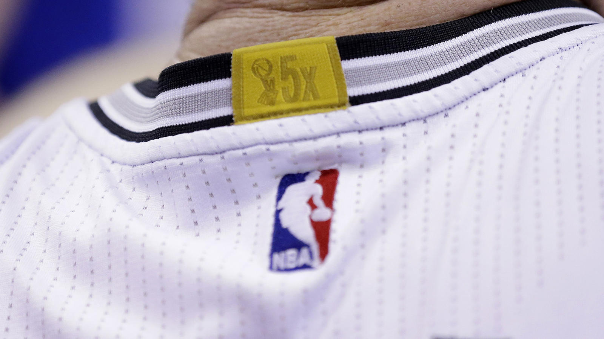
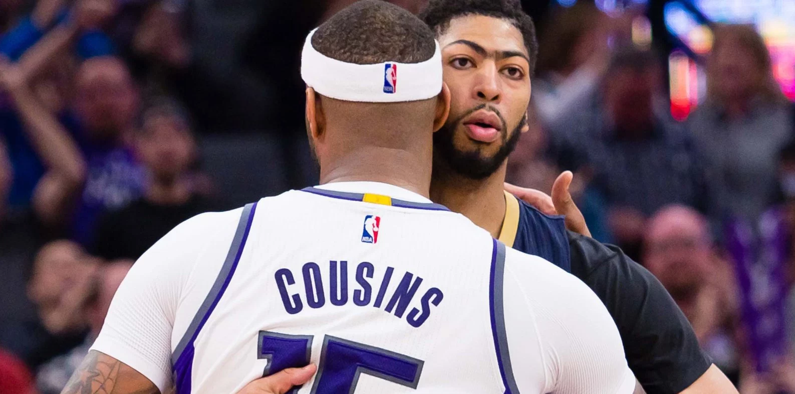

# Who Deserves the NBA's Gold Patch?

For the 2014-15 season, the NBA introduced a [gold patch](http://www.espn.com/nba/story/_/id/11219276/nba-jerseys-now-feature-gold-tabs-collars-indicate-teams-won-titles) to be worn on the back collar of the league's past champions.  Inspired by the World Cup, the patches are a visible reminder of just how hard it is to win an NBA championship.  As of the 2019-20 season, only 18 of the league's 30 teams wear the patch.  The other 12 do not.  

But League Pass aficionados will have a counterintuitive reaction to those numbers.  It seems even *fewer* teams should wear them.  Some just don't look right: 

*Remember that one?  Me neither.* 

Here we review each of the 30 teams' claim to the patch.  Based on two *principles for patches*, we find that six of the eighteen patches deserve to be revoked.  Two teams particularly deserve this revocation. 

In the process, we'll create a tiered hierarchy of the league's franchises, based on their historical success.  We find the teams fall in three tiers:

*   **Tier 1**: Undisputed Champions
*   **Tier 2**: The Disputed Lands
*   **Tier 3**: No Patch For You

Each of the teams in Tier 1 is listed alongside their number of championships. 

## Tier 1: Undisputed Champions

### Tier 1a: The Perma-Dynasties

*   Boston Celtics (16x)
*   Los Angeles Lakers (16x)

The NBA has always been a league of dynasties.  Nearly from its inception, these two franchises have competed for historical supremacy.  Their success extends through the league's history, from its earliest days to their modern-era championships in 2008-10. 

### Tier 1b: The Uni-Dynasties

*   Chicago Bulls (6x)
*   San Antonio Spurs (5x)

### Tier 1c: The Modern Champions

*   Golden State Warriors (6x)
*   Toronto Raptors (1x)
*   Cleveland Cavaliers (1x)
*   Dallas Mavericks (1x)
*   Miami Heat (2x)
*   Detroit Pistons (3x)
*   Houston Rockets (2x)

These next two sub-tiers illustrate just how difficult it has been to win an NBA championship, and how much more difficult to win more than one or two.  Each of these eight teams has won the championship since 1991, the beginning of the Jordan-Bulls dynastic run. 

While the two perma-dynasties stand a cut above, there is a blurrier line between sub-tiers 1b and 1c.  Sitting on the borderline: the league's most recent "dynasty", Golden State.  Their ongoing string of success (3 championships, 5 Finals appearances from 2015-19) is incredible, but remains both shorter, and includes less championship success, than the runs of Chicago or San Antonio.  

Applying of the term “dynasty” to the Spurs and Bulls, but not to the Warriors, may prove distracting.  This is not our aim. (GSW may in fact deserve a tier of its own, in between 1b and 1c.)  While sports media may obsessively debate the definitions of terms such as “dynasty” or “elite”, we have no such goal.  Our goals are exposing the fraudulent patch-wearers, and celebrating the real ones.  And all of these teams qualify as real.  

## Tier 3: No Patch For You

No, we did not mis-count tiers.  Our interest really lies in Tier 2, with the teams under dispute.  We'll address them last, and in greatest detail.  First we'll cover the teams in our bottom tier: non-patch-wearers.  Each of the teams without patches is listed alongside the year of their entry into the NBA.  

### Tier 3a: No Patch, *Some* Claim

*   Oklahoma City Thunder (1967 / 2008)

Only one non-patch team has a conceivable claim to wearing one.  The Thunder's predecessor, the Seattle Supersonics, won the 1979 championship.  Per their separation agreement with Seattle, the OKC franchise owns the Supersonics records, and [reportedly](https://sports.yahoo.com/oklahoma-city-s-thunder-decline-to-celebrate-seattle-s-1979-championship-with-a-jersey-patch-190633234.html?y20=1) were offered the choice of whether to wear the gold patch.  They declined.  And we wholeheartedly agree.

### Tier 3b: The Never-Champions

*   Phoenix Suns (1968)
*   Los Angeles Clippers (1970)
*   Utah Jazz (1974)
*   Denver Nuggets (1976)
*   Indiana Pacers (1976)
*   Brooklyn Nets (1976)
*   Charlotte Hornets (1988)
*   Minnesota Timberwolves (1989)
*   Orlando Magic (1989)
*   Memphis Grizzlies (1995)
*   New Orleans Pelicans (2002)

This list really shows how hard it is to win in the NBA.  

Of the eleven never-champion franchises, five (New Orleans, Memphis, Orlando, Minnesota, Charlotte) are relatively modern expansion teams, starting in the 1980s or later.  The other six teams have had a rough life.  Three of the four teams who moved from the ABA - Denver, Indiana, and Brooklyn - have never won championships.  (The sole ABA exception: San Antonio.)  And three franchises which began even before the ABA merger - Utah, Phoenix, and the Clippers - have never tasted gold.  

Six of these eleven teams (Minnesota, New Orleans, Denver, Charlotte, Memphis, Clippers) have never won their *conference*, and hence never played in an NBA Finals.  

## Tier 2: The Disputed Lands

Now that we have established the ten teams which undisptuably deserve the championship patch, and the thirteen which do not, we can dig into the teams at issue.  First we should establish our *principles for patches*.

#### Rule 1: Moving the team forfeits patch-rights

*   Bill Simmons's *Book of Basketball* includes something like the converse of this rule: once a team wins the title, they cannot move.  These ideas are similar but distinct.  To the extent patch-ineligibility serves as a punishment, we can think of Rule 1 as an enforcement mechanism for a lighter form of Simmons's rule. 
*   Rule 1 won't cover "in-area" moves, such as the Nets short jaunts from New York, to New Jersey, and back to Brooklyn, or the Warriors changes from San Francisco to "Golden State". 
*   Rule 1 is also the rationale by which we support Oklahoma City's decision to not wear the patch earned by the 1979 Supersonics. 

#### Rule 2: At some point, titles time out

- This rule is meant to capture another league reality: it has gotten far harder to win.  It was just way easier to win in the 1950s, in a league of eight teams in which most players needed summer jobs, than it is today.  The modern NBA has both expanded in teams and in geography, but most importantly in impact.  There is far more money on the line, and far more incentive to win. 
- Just *when* titles time-out is a topic we'll discuss in more depth.  But the underlying principle is that championships can get too old for patch eligibility. 

Note we do not advocate the revocation of any team's *championships*.  These are clearly events which happened.  (This isn't the NCAA!)  Every championship team won the only way it could: by beating the opponents in front of them.  Their competition, era, and circumstances were not up to them.  But the jersey patch is a separate matter.  In essence the principles form a set of criteria by which championship wins can be either "patch-eligible", or not.  

While there is room for subtlety in setting these criteria, there is little room to doubt that two teams make a mockery of the patch. 

### Tier 2b: Absolute Jokes

*   Atlanta Hawks (1x, 1958)
*   Sacramento Kings (1x, 1951)

These two capture the point of our principles.  Both teams violate both of them.  They each won once, eons ago, and both have moved since.  The Kings' sole championship came as the Rochester Royals in 1951, and the Hawks' came as the St Louis Hawks in 1958.  Along with their moves, one changed names to boot.  The retention of the name "Hawks" is really the only bright spot here. 

These two teams likely generate the majority of the double-takes referenced in our introduction.  They come off as either total wanna-be's, or just delusional.  (And were among the motivation for this writing.)  If there is no other take-away from this article, let it be a reminder of how pathetic they look. 

### Tier 2a: The Borderline

This leaves the remaining five teams on the fringe.  In order of most recent championships:

*   Philadelphia 76ers (3x: 1955, 67, 83)
*   Washington Bullets/ Wizards (1x: 1978)
*   Portland Trail Blazers (1x: 1977)
*   New York Knicks (2x: 1970, 73)
*   Milwaukee Bucks (1x: 1971)

These teams share a common thread: each has been in their cities for a long time - and have not won in a long time.  They are the real test of our question as to _when_ championships should time out.  

Time-out could be a rolling period of time, for example the past 30 years' champions.  Or it could be a set milestone, before which championships are patch-ineligible.  Likely choices include the major events of the league's history:

*   League Founding: 1946
*   Racial Integration: 1950
*   ABA Merger: 1976
*   Three Point Line Introduced: 1979
*   Magic/Bird Era Begins: 1979
*   Jordan Era Begins: 1984
*   Unrestricted Free Agency: 1988
*   Lebron Era Begins: 2003

It also helps to review the league's champions by year.  A funny phenomenon happened in the late 1970s:

*   1975: Golden State Warriors
*   1976: Boston Celtics
*   1977: Portland Trail Blazers
*   1978: Washington Bullets
*   1979: Seattle Supersonics

For half a decade, the typically dynastic NBA was all but overturned with upstart, one-time champions.  Three of the five champions from this span never won another title.  A fourth (Golden State) failed to for the next 40 years.  This list looks more typical of the modern NFL, where teams' fortunes rise and fall on a yearly basis. 

What happened?  Simmons's _Book of Basketball_ again has great insight.  Two factors are particularly relevant.  First, the league had reached a nadir in popularity.  Its biggest games were not aired on live TV.  Broad perception was that the NBA was _too black_ to connect with mainstream American audiences.  Second, this was what Simmons calls the cocaine era.  Tales abound of players' drug problems, affects on their careers and in-season performance.  (These two factors are of course related.) 

### The Cut-Off Date

This informs our view of when to cut off patch-eligibility. 

*   Championships from the cocaine era are no longer patch-eligible.  
*   Neither are championships from before it. 

The end of the cocaine era coincides with the 1979 introduction of the three-point line, and the same year's entry of Larry Bird and Magic Johnson.  The same season included Magic Johnson's famed NBA Finals triple-double, filling in at center for an injured Kareem Abdul-Jabbar.  This is where, for our purposes, the modern NBA begins: with the 1979-80 season.  

The championships of the Bucks, Knicks, Blazers, and Bullets/ Wizards, are all therefore rendered patch-ineligible.  All of these titles are now more than 40 years old.  Two of the four were one-time events, in a uniquely strange period in league history.  (And note Washington even renamed their team, testing the limits of Rule 1.)

Of the borderline teams, only the 76ers 1983 championship remains patch-eligible.  Despite only five years passing between them, the 1983 season was ages more "modern" than the next most-recent borderline-championship (Washington in 1978).  This further reinforces the choice of 1979-80 as the cut-off season. 

## The New Patch List

Six of the league's seventeen gold patches deserve to be revoked.  Two patch-wearing teams (Atlanta and Sacramento) have only laughable claims.  Four more (Milwaukee, New York, Portland, Washington) have claims which can be argued - but we find their championships to be outdated, from a begone era of NBA basketball. 

After the patch reshuffling:

### Patches (12 Teams)

#### Tier 1a: The Perma-Dynasties

* Boston Celtics (16x)
* Los Angeles Lakers (16x)

#### Tier 1b: The Uni-Dynasties

* Chicago Bulls (6x)
* San Antonio Spurs (5x)

#### Tier 1c: The Modern Champions

* Golden State Warriors (6x)
* Toronto Raptors (1x)
* Cleveland Cavaliers (1x)
* Dallas Mavericks (1x)
* Miami Heat (2x)
* Detroit Pistons (3x)
* Houston Rockets (2x)

#### Tier 1d: The Borderline

* Philadelphia 76ers (3x: 1955, 67, 83)

### No Patches (18 Teams)

#### Tier 2a: Revoked

* Washington Bullets/ Wizards (1x: 1978)
* Portland Trail Blazers (1x: 1977)
* New York Knicks (2x: 1970, 73)
* Milwaukee Bucks (1x: 1971)

#### Tier 2b: Absolute Jokes

* Atlanta Hawks (1x, 1958)
* Sacramento Kings (1x, 1951)

#### Tier 3a: No Patch, Some Claim

* Oklahoma City Thunder (Founded 1967 / 2008)

#### Tier 3b: Never-Champions

* Phoenix Suns (1968)
* Los Angeles Clippers (1970)
* Utah Jazz (1974)
* Denver Nuggets (1976)
* Indiana Pacers (1976)
* Brooklyn Nets (1976)
* Charlotte Hornets (1988)
* Minnesota Timberwolves (1989)
* Orlando Magic (1989)
* Memphis Grizzlies (1995)
* New Orleans Pelicans (2002)

*This article was updated to include the Toronto Raptors 2019 championship.*

